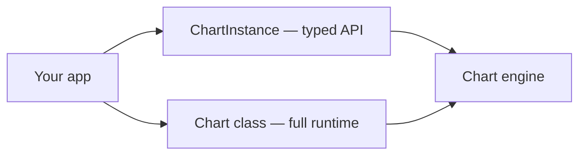

import GettingStartedDemo from "@site/src/components/GettingStartedDemo";

# Chart runtime access

Most apps should use **`createChart()`**. It returns a **`ChartInstance`** — a typed, stable API for loading data, drawing, settings, and events.

Sometimes you need one more knob that exists on the engine but is **not** on `ChartInstance` yet. That is when you import the **`Chart` class** directly.

<GettingStartedDemo
  variant="vanilla"
  caption="Runtime access is about the engine underneath — with or without ChartUI."
/>

## The simple rule

| Approach | Use when… |
| --- | --- |
| `createChart({ container })` | **Always start here** — production integrations, React, connectors |
| `new Chart({ container })` | You need a specific runtime method listed below and accept tighter coupling to internals |

Both talk to the **same engine**. `ChartInstance` is the supported public contract; `Chart` is the full runtime class.



## What you get on `Chart` that matters today

These methods are useful on the class today. Check [ChartInstance](../api-reference/chart-instance) first — many everyday tasks are already there (`appendTick`, `fit`, `setLayoutMode`, …).

| Method | What it does |
| --- | --- |
| `moveToEnd()` | Scroll viewport to the latest bar |
| `moveToStamp(stamp)` | Jump the viewport to a specific candle time |
| `upsertCandle(candle, recalculate?)` | Update or insert **one** candle in the main series |
| `addPanelToModel()` | Add a new chart panel (e.g. for an oscillator) |
| `getScriptsManager()` | Low-level access to running indicator/strategy controllers |
| `prependMainSeriesData(data)` | **Stub today** — do not rely on it for history loading |

For scrolling and jumping, [Navigation and viewport](../chart-usage/navigation-and-viewport) covers the `ChartInstance` path first.

## Example — jump to a date

```ts
import Chart from "@efixdata/exeria-chart";

const chart = new Chart({ container });
chart.init();
await chart.setMainSeriesData(candles, interval);

// Go to the latest bar
chart.moveToEnd();

// Or jump to a specific candle
chart.moveToStamp(candles[40].stamp);
```

## Example — add an extra panel

Indicators like RSI often live in a **separate panel** below the price chart. The runtime can add one programmatically:

```ts
const panel = chart.addPanelToModel();

console.log(panel.id); // use when wiring scripts to that panel
```

The engine redistributes panel height so the new pane has room.

## Example — upsert one candle

When your feed sends a **correction** to an existing bar (same `stamp`, new OHLC), `upsertCandle` merges it instead of appending a duplicate:

```ts
chart.upsertCandle({
  stamp: candles[0].stamp,
  o: 101.2,
  h: 103.4,
  l: 100.8,
  c: 102.6,
  v: 3100,
});
```

For normal live streaming, `appendTick` on `ChartInstance` is usually enough — see [Realtime updates](../chart-usage/realtime-updates).

## Example — scripts manager (advanced)

`getScriptsManager()` returns the internal map of running Fusion scripts. Use this only when you are building custom tooling on top of indicators or strategies — not for adding a simple MA from the UI.

```ts
const scripts = chart.getScriptsManager();
console.log(Object.keys(scripts));
```

For adding indicators the supported way, see [Add an indicator](../tutorials/add-an-indicator).

## What not to do

| Avoid | Do instead |
| --- | --- |
| `new Chart()` everywhere “just in case” | `createChart()` until you hit a real gap |
| `prependMainSeriesData()` for infinite scroll | Load history with `setMainSeriesData` / `appendMainSeriesData` on `ChartInstance` |
| Reading private fields on the instance | Stick to documented methods |

## When to stay on `ChartInstance`

You **do not** need `Chart` for:

- loading data and live ticks
- drawings via `toolDrawer`
- chart settings, themes, locale
- layout modes and environment (`setLayoutMode`, `getChartEnvironment`)
- multi-instrument overlays

All of that is on the typed surface — [Chart usage](../chart-usage/) and [API reference](../api-reference/chart-instance).

## What is next?

- [Navigation and viewport](../chart-usage/navigation-and-viewport) — scrolling without dropping to `Chart`
- [React UI integration](./react-ui-integration) — if your next layer is ChartUI
- [Programmatic wiring](../scripts/programmatic-wiring) — indicators and strategies in code
