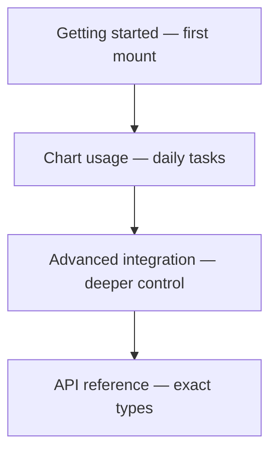

import GettingStartedDemo from "@site/src/components/GettingStartedDemo";

# Advanced integration

You already have a chart from [Getting started](../getting-started/) and know the daily tasks from [Chart usage](../chart-usage/). **Advanced integration** is for when you need more control:

- wrap the chart in **ChartUI** without layout bugs
- tune the **toolbar** and left drawing menu
- ship a **phone-friendly** layout
- reach for the **`Chart` class** when the typed API is not enough

Each page stands alone. You do not need to read them in order — pick the problem you have right now.

<GettingStartedDemo
  variant="react"
  caption="Most advanced topics assume ChartUI around your chart — like this."
/>

## Pick your page

| You want to… | Read |
| --- | --- |
| Understand `createChart` vs `new Chart()` | [Chart runtime access](./chart-class-runtime) |
| Mount ChartUI correctly, themes, share, SSR | [React UI integration](./react-ui-integration) |
| Hide toolbar buttons, wire interval/share | [React UI toolbar and tools](./react-ui-toolbar-and-tools) |
| Phones, tablets, touch, compact layout | [Mobile and responsive](./mobile-and-responsive) |

## How this relates to other sections

- **[Chart usage](../chart-usage/)** explains what end users see (toolbar buttons, chart settings, gestures) in plain language.
- **Advanced integration** (here) explains what **you** configure in code (`ChartUI` props, layout modes, runtime hooks).
- **[API reference](../api-reference/chart-instance)** lists every typed method when you need signatures.

## Two integration levels

| Level | When to use it |
| --- | --- |
| **`createChart()` + `ChartInstance`** | Default for almost every app — stable, typed surface |
| **`new Chart()`** | Only when you need runtime methods not on `ChartInstance` yet |

Same engine underneath. Start with `createChart()`; drop to `Chart` only when you hit a documented gap.

## Quick troubleshooting

| Problem | Page to check |
| --- | --- |
| ChartUI shows toolbar but chart area is empty | [React UI integration](./react-ui-integration) — height and child container |
| Interval button does nothing in my app | [React UI toolbar and tools](./react-ui-toolbar-and-tools) — `onIntervalChange` |
| Toolbar too crowded on phone | [Mobile and responsive](./mobile-and-responsive) — `mobileLayout` |
| Need extra panel or script manager | [Chart runtime access](./chart-class-runtime) |

Ready? Open the page that matches your task, or continue with [React UI integration](./react-ui-integration) if you use React.
