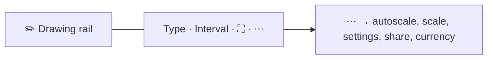

import GettingStartedDemo from "@site/src/components/GettingStartedDemo";

# Mobile and responsive charts

Your chart fills its **container** — it does not magically know it is on a phone. Mobile support is three layers you wire together:

1. **Page** — viewport meta tag and scroll containment
2. **Chart engine** — compact axes and fonts below 600px width
3. **ChartUI** — dense toolbar, overflow menu, safe areas

<GettingStartedDemo
  variant="react"
  caption="On a narrow screen the toolbar compacts — the chart still needs a real height."
/>

End-user guide to toolbar buttons on mobile: [Top toolbar and mobile](../chart-usage/top-toolbar-and-mobile).

## Step 1 — viewport meta tag

On notched iPhones, add `viewport-fit=cover` so safe-area insets work:

```html
<meta
  name="viewport"
  content="width=device-width, initial-scale=1, viewport-fit=cover"
/>
```

ChartUI reads `env(safe-area-inset-*)` on its outer shell. Without the meta tag, padding may be zero on iOS.

In Next.js, put this in `pages/_app` via `next/head` (not `_document`).

## Step 2 — give the chart a height

The canvas follows the **child div** inside ChartUI:

```tsx
<div style={{ width: "100%", height: "min(70vh, 560px)", minHeight: 320 }}>
  <ChartUI chart={chart}>
    <div ref={containerRef} style={{ width: "100%", height: "100%" }} />
  </ChartUI>
</div>
```

| Rule | Why |
| --- | --- |
| Non-zero height (`vh`, `dvh`, px) | Zero height = invisible chart |
| `min-height: 0` on flex parents | Flex children otherwise refuse to shrink |
| Avoid horizontal page scroll | `overflow-x: clip` on page or panel |

The engine uses `ResizeObserver` and calls `fit()` when the box changes — you do not manually resize on orientation change if the container updates.

## Step 3 — chart layout modes

Pass `layout` when creating the chart:

```ts
import { createChart, CHART_COMPACT_BREAKPOINT_PX } from "@efixdata/exeria-chart";

const chart = createChart({
  container: el,
  layout: {
    mode: "auto",
    breakpoints: {
      compact: CHART_COMPACT_BREAKPOINT_PX, // default 600
    },
  },
});
```

### What `auto` picks

| Effective mode | When |
| --- | --- |
| `desktop` | Wide screen + fine pointer (mouse) |
| `compact` | Width ≤ compact breakpoint (default 600px) |
| `touch` | Coarse pointer on a wide screen (e.g. tablet) |

Override manually if you need to:

```ts
chart.setLayoutMode("desktop"); // force desktop metrics
chart.setLayoutMode("auto");    // follow media queries again
```

In `compact` mode, `fit()` uses narrower value axes, shorter time ticks, and tighter legend spacing.

Listen for changes:

```ts
chart.subscribe("ENVIRONMENT_CHANGE", (env) => {
  console.log(env.layoutMode, env.isCompact);
});
```

Global breakpoint (all charts): `configureChartEnvironment({ compactBreakpoint: 640 })`. Per-chart: `layout.breakpoints.compact` on `createChart`.

React hook from the UI package:

```tsx
import { useChartEnvironment } from "@efixdata/exeria-chart-ui-react";

function MyToolbar() {
  const { isCompact, layoutMode, isTouch } = useChartEnvironment();
  // hide custom chrome when isCompact
}
```

Types and helpers: [Chart environment reference](../api-reference/chart-environment).

## Step 4 — ChartUI mobile props

```tsx
import {
  ChartUI,
  applyChartUiEnvironmentOptions,
} from "@efixdata/exeria-chart-ui-react";

applyChartUiEnvironmentOptions({ compactBreakpoint: 600 });

<ChartUI
  chart={chart}
  mobileLayout="minimal"
  compactBreakpoint={600}
  theme={{ edgeInset: 8 }}
>
  <div ref={containerRef} style={{ width: "100%", height: "100%" }} />
</ChartUI>
```

| Prop | What it does |
| --- | --- |
| `mobileLayout="default"` | Full compact toolbar row |
| `mobileLayout="minimal"` | Indicators only in ⋯ overflow, not on main row |
| `compactBreakpoint` | Sync UI with chart (default **600**) |
| `theme.edgeInset` | Extra padding + safe areas |

ChartUI calls `chart.setLayoutMode("auto")` on mount and re-runs `fit()` when the breakpoint or chart instance changes.

### Compact toolbar (≤ breakpoint)



- **Pencil** — toggles drawing-tools rail on the chart edge (no page reflow)
- **Type, interval, fullscreen, ⋯** — stay on the top row
- **⋯ overflow** — autoscale, price scale, settings, share (if on), currency
- **`minimal`** — indicators appear only under ⋯

### Fullscreen

Fullscreen targets the ChartUI container. Safe-area padding and `min-height: 100dvh` apply while active. Layout re-syncs after enter/exit (including `visualViewport` resize on mobile Safari).

## Touch gestures on the chart surface

| Gesture | Result |
| --- | --- |
| **Pan** | Scroll along the time axis |
| **Pinch** | Zoom (throttled per frame) |
| **Swipe** | Inertial scroll after release |
| **Long press** | Context menu (go to start/end, autoscale, crosshair) |

Crosshair mode keeps the last position after you lift your finger (**sticky crosshair**). Tooltips on coarse pointers are suppressed in shared UI so labels do not get stuck.

Pinch and pan close an open long-press menu. Menu position uses **viewport** coordinates (`clientX` / `clientY`) so it stays under your finger when the page scrolls.

More interaction detail: [Drawing and interaction](../chart-usage/drawing-and-interaction), [Navigation and viewport](../chart-usage/navigation-and-viewport).

## CSS tokens (optional)

If you build custom chrome aligned with ChartUI:

```css
--ui-mobile-breakpoint: 600px;
--ui-toolbar-touch: 40px;
```

Use the same 600px in your media queries as `compactBreakpoint`.

## What is supported vs what you still own

**Works out of the box**

- Container resize + device pixel ratio
- Compact layout in the chart core
- Touch pan, pinch, swipe, long-press menu
- Compact ChartUI toolbar + overflow + `minimal` layout
- Safe-area-aware shell and fullscreen

**You still implement**

- Viewport meta and page scroll behavior
- Fetching data on slow networks and interval changes
- Headers, tabs, and native WebView bridges outside ChartUI

## Quick troubleshooting

| Problem | Check |
| --- | --- |
| Chart flat line on phone | Container height — Step 2 |
| Toolbar overlaps content | `edgeInset` and safe-area meta |
| Axes too wide on mobile | `layout.mode: "auto"` and `compactBreakpoint` |
| Pinch zoom feels stuck | Parent `touch-action` — avoid blocking on chart parent |
| Custom header + ChartUI clash | `useChartEnvironment().isCompact` to hide your chrome |

Manual QA list: [Mobile QA checklist](../guides/mobile-qa-checklist).

## What is next?

- [React UI integration](./react-ui-integration) — ChartUI mount pattern
- [Top toolbar and mobile](../chart-usage/top-toolbar-and-mobile) — what each button does
- [Chart environment reference](../api-reference/chart-environment) — types and exports
- [Forex platforms starter](/starters/forex-platforms) — full UI on a narrow layout
