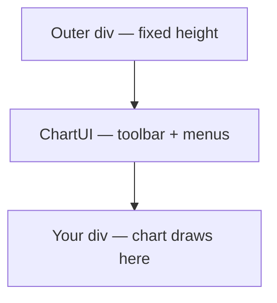

import GettingStartedDemo from "@site/src/components/GettingStartedDemo";

# React UI integration

**ChartUI** is the React wrapper that adds the top toolbar, left drawing menu, and settings dialogs around your chart. You installed it in the [React quickstart](../getting-started/react).

This page covers the details that bite beginners **after** the first mount works: layout height, passing `chart={null}` during load, two different theme systems, and Next.js boundaries. For a props lookup table, see [ChartUI reference](../api-reference/chart-ui).

<GettingStartedDemo
  variant="react"
  caption="ChartUI wraps your chart div — toolbar on top, tools on the left."
/>

## The layout contract (read this first)

ChartUI needs **two nested boxes**:

1. An **outer wrapper** with a real height (pixels, `vh`, or flex child with `min-height: 0`).
2. Your **chart container** `<div>` as a **child** of ChartUI, filling 100% width and height.

```tsx
<div style={{ height: 560 }}>
  <ChartUI chart={chart}>
    <div ref={containerRef} style={{ width: "100%", height: "100%" }} />
  </ChartUI>
</div>
```



### Common mistakes

| Mistake | Symptom | Fix |
| --- | --- | --- |
| No height on outer wrapper | Toolbar visible, chart area height 0 | Set `height: 560` or `min(70vh, 560px)` |
| Chart div **next to** ChartUI instead of inside | Broken layout or missing canvas | Nest the div **inside** `<ChartUI>` |
| Parent flex without `min-height: 0` | Chart squashed or invisible on mobile | Add `min-height: 0` on flex parents |

End-user view of the toolbar: [Top toolbar and mobile](../chart-usage/top-toolbar-and-mobile).

## Nullable chart — load without flicker

ChartUI accepts `chart={null}` while you create the engine in `useEffect`:

```tsx
const [chart, setChart] = useState<ChartInstance | null>(null);

return (
  <ChartUI chart={chart}>
    <div ref={containerRef} style={{ width: "100%", height: "100%" }} />
  </ChartUI>
);
```

**Why?** The toolbar shell mounts immediately. When `setMainSeriesData` finishes, you `setChart(instance)` and the UI wires up interval buttons, settings, and drawings.

This is the same pattern as the [React quickstart](../getting-started/react).

## Two theme systems (do not mix them up)

| What you style | Where |
| --- | --- |
| **Candles, axes, grid, crosshair** | `createChart({ theme, themeVariant })` |
| **Toolbar, dialogs, inputs, scrollbars** | `<ChartUI theme={{ … }} />` |

Chart constructor — chart surface:

```ts
createChart({
  container,
  theme: { /* candle colors, grid, scales */ },
  themeVariant: "dark",
});
```

ChartUI — chrome around the chart:

```tsx
<ChartUI
  chart={chart}
  theme={{
    gap: 8,
    accentColor: "#14f7ab",
    toolbar: {
      background: "#111827",
      showShareChartButton: true,
      showChartScaleSwitch: true,
      showCurrency: true,
      topMenuPosition: "right",
    },
    subMenu: { background: "#0f172a" },
    dialog: {},
    inputs: {},
    scrollBar: {},
  }}
>
  <div ref={containerRef} style={{ width: "100%", height: "100%" }} />
</ChartUI>
```

Tutorial: [Custom theme](../tutorials/custom-theme). Deep settings UI: [Chart settings](../chart-usage/chart-settings).

## Interval changes — connect to your data

When the user picks a new timeframe in the toolbar, **your app** must fetch new candles. ChartUI exposes `onIntervalChange`:

```tsx
<ChartUI
  chart={chart}
  onIntervalChange={(symbol) => {
    // symbol is like "1h" or "1d"
    loadCandlesForInterval(symbol);
  }}
>
  <div ref={containerRef} style={{ width: "100%", height: "100%" }} />
</ChartUI>
```

Notes:

- Choices come from `chart.getInstrument()?.availableIntervals`
- ChartUI also listens to runtime `INTERVAL_CHANGE` to keep the selected button in sync
- Without this callback, the button may change but your data will not

## Share and download

`shareConfig` powers the built-in share menu (Twitter, Telegram, copy link, download):

```tsx
<ChartUI
  chart={chart}
  theme={{ toolbar: { showShareChartButton: true } }}
  shareConfig={{
    apiUri: "/api/share-image",
    templateText: "Chart snapshot",
    sourceUrl: "https://your-app.example/chart/btcusd",
    twitterTextTemplate: "$BTC chart snapshot",
    telegramTextTemplate: "BTC chart snapshot",
    watermarkSvg: "<svg>...</svg>",
  }}
>
  <div ref={containerRef} style={{ width: "100%", height: "100%" }} />
</ChartUI>
```

| Piece | Behavior |
| --- | --- |
| Share button visibility | `theme.toolbar.showShareChartButton` |
| Default API | Posts to `/api/share-image/session/start` |
| Download | Uses `chart.onDownload()` with your watermark |
| No backend yet? | Hide the share button; offer download only in your app |

Button-level details: [React UI toolbar and tools](./react-ui-toolbar-and-tools).

## Mobile props (short version)

```tsx
<ChartUI
  chart={chart}
  mobileLayout="minimal"
  compactBreakpoint={600}
  theme={{ edgeInset: 8 }}
>
  <div ref={containerRef} style={{ width: "100%", height: "100%" }} />
</ChartUI>
```

| Prop | Meaning |
| --- | --- |
| `mobileLayout="minimal"` | On narrow screens, indicators move into the ⋯ menu |
| `compactBreakpoint` | Width in px where compact UI kicks in (default **600**) |
| `theme.edgeInset` | Extra padding on top of iOS safe areas |

Full guide: [Mobile and responsive](./mobile-and-responsive).

## Left menu vs programmatic drawings

The left menu is a **shortcut** for cursor mode and a **subset** of drawing tools. You can still create any documented tool via `chart.toolDrawer` in code — even tools not shown in the menu.

- Runtime API: [Drawing and interaction](../chart-usage/drawing-and-interaction)
- Exact menu list: [React UI toolbar and tools](./react-ui-toolbar-and-tools)

## SSR and Next.js

The chart uses `window`, canvas, and `ResizeObserver`. It **cannot** run on the server.

| Framework | Pattern |
| --- | --- |
| Next.js App Router | Client component + `dynamic(..., { ssr: false })` optional |
| Vite / CRA | Normal client render — no extra step |

Guides: [Next.js App Router](../getting-started/nextjs-app-router), [Vite + React](../getting-started/vite-react).

## Recommended integration checklist

1. Outer wrapper with fixed height.
2. Mount `<ChartUI chart={null}>` immediately.
3. In `useEffect`: `createChart` → `init()` → `setMainSeriesData`.
4. `setChart(instance)` when data is ready.
5. `destroy()` on unmount.
6. Chart surface theme on `createChart`; toolbar theme on `ChartUI`.
7. Wire `onIntervalChange` if intervals come from your API.

## What is next?

- [React UI toolbar and tools](./react-ui-toolbar-and-tools) — hide buttons, share flow, menu tool list
- [Mobile and responsive](./mobile-and-responsive) — viewport, touch, compact layout
- [Mobile QA checklist](../guides/mobile-qa-checklist) — manual test list
- [Theming overview](../theming/overview) — chart surface colors
