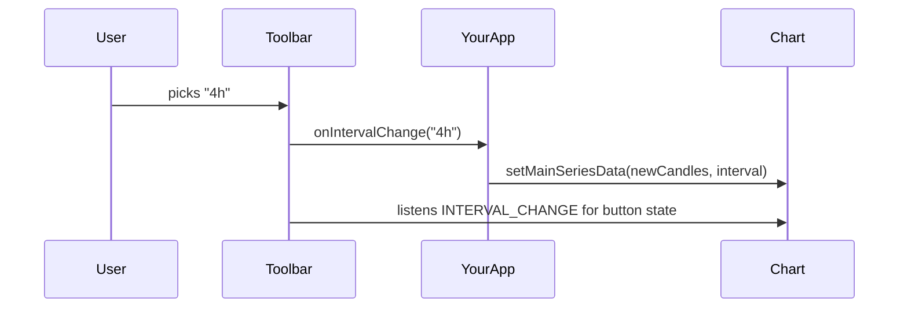

import GettingStartedDemo from "@site/src/components/GettingStartedDemo";

# React UI toolbar and tools

You mounted **ChartUI** ([React UI integration](./react-ui-integration)). This page is the **integrator's cheat sheet**: which buttons exist, how to hide them, how share works, and which drawing tools appear in the left menu.

For what each button **does for the trader**, see [Top toolbar and mobile](../chart-usage/top-toolbar-and-mobile).

<GettingStartedDemo
  variant="react"
  caption="Use theme.toolbar to show or hide parts of this bar."
/>

## Top toolbar — what renders today

The built-in **TopMenu** shows (left to right on desktop):

| Control | Purpose |
| --- | --- |
| Chart type | Candles, line, Heikin-Ashi, … |
| Interval | Timeframe (1m, 1h, 1d, …) |
| Indicators | Open indicator picker |
| Autoscale | Fit Y axis to visible range |
| Scale switch | Linear / log / percent |
| Settings | Chart settings dialog |
| Fullscreen | Expand chart shell |
| Share | Social share + download (when enabled) |
| Currency | Display currency label |

Order is fixed — ChartUI does not support injecting custom buttons into the middle of this row today.

## Hide or reposition toolbar pieces

Pass `theme.toolbar` on ChartUI:

```tsx
<ChartUI
  chart={chart}
  theme={{
    toolbar: {
      background: "#111827",
      showShareChartButton: false,
      showChartScaleSwitch: true,
      showCurrency: false,
      topMenuPosition: "right",
    },
    subMenu: { background: "#0f172a" },
    splitButton: {},
    dialog: {},
    inputs: {},
    scrollBar: {},
  }}
>
  <div ref={containerRef} style={{ width: "100%", height: "100%" }} />
</ChartUI>
```

| Toggle | Effect |
| --- | --- |
| `showShareChartButton` | Share menu on/off |
| `showChartScaleSwitch` | Lin / Log / % switch on/off |
| `showCurrency` | Currency label on/off |
| `topMenuPosition: "right"` | Right-aligned toolbar variant |

Need a completely custom toolbar? Build your own shell and use `createChart` without ChartUI — or hide groups you do not need and add buttons in your app header.

## Interval selector + your data layer

The interval dropdown reads `chart.getInstrument()?.availableIntervals`. When the user picks a value, ChartUI calls your callback:

```tsx
<ChartUI
  chart={chart}
  onIntervalChange={(symbol) => {
    // e.g. "1h" — fetch and call setMainSeriesData again
    reloadHistory(symbol);
  }}
>
  <div ref={containerRef} style={{ width: "100%", height: "100%" }} />
</ChartUI>
```



If `availableIntervals` is empty, the selector has nothing useful to show — set them on your `Instrument` when you wire the chart.

## Share menu

Enable the button and pass `shareConfig`:

```tsx
<ChartUI
  chart={chart}
  theme={{ toolbar: { showShareChartButton: true } }}
  shareConfig={{
    apiUri: "/api/share-image",
    templateText: "Chart snapshot",
    sourceUrl: "https://your-app.example/chart/btcusd",
    twitterTextTemplate: "$BTC chart snapshot",
    telegramTextTemplate: "BTC chart snapshot",
    watermarkSvg: "<svg>...</svg>",
  }}
>
  <div ref={containerRef} style={{ width: "100%", height: "100%" }} />
</ChartUI>
```

Built-in menu entries:

- Twitter
- Telegram
- Copy image link
- Download image

| Detail | Behavior |
| --- | --- |
| API | POST to `${apiUri}/session/start` (default `/api/share-image`) |
| Watermark | `watermarkSvg` or `watermarkDataUrl` |
| `sourceUrl` | Falls back to `window.location.href` |
| Download | `chart.onDownload()` with active watermark |
| Errors | Logged to console — no built-in error toast yet |

**No share backend?** Set `showShareChartButton: false` and handle export in your own UI.

## Left menu — three groups

The vertical strip on the left has:

1. **Cursor** — default, crosshair, eraser
2. **Lock** — toggle selecting/moving drawings (`setObjectSelectionAllowed`)
3. **Drawing tools** — grouped list below

### Cursor modes

| Mode | Runtime value |
| --- | --- |
| Default arrow | `DEFAULT` |
| Crosshair | `CROSSHAIR` |
| Eraser | `ERASER` |

When a drawing tool is active, the UI maps back to default cursor styling after the shape is placed (`STAGE` mode).

### Lock button

Toggles whether users can select and drag existing drawings. Same as locking all in [Chart settings](../chart-usage/chart-settings) → Drawings tab.

### Drawing tools in the menu today

**Lines**

- `trendLine`, `parallelChannel`, `hLine`, `vLine`, `mLine`

**Shapes**

- `arrow`, `ellipse`, `triangle`, `box`

**Analytical**

- `abcd`, `cycle`, `fibonLines`

**Standalone**

- `priceTag`, `hRange`, `vRange`

Full catalog (34 tools): [Drawing tools reference](../drawing-tools/tool-reference).

## Important boundary

The **runtime** supports more tools than the React menu shows. Examples:

- `textAnnotation` exists in code but is **not** in the left menu
- You can create `pitchfork`, `gannFan`, volume profile, etc. via `toolDrawer.drawTool()` without adding menu entries

| Need | Path |
| --- | --- |
| Tools visible in ChartUI menu | Listed above only |
| Any documented drawing type | `chart.toolDrawer` — [Drawing and interaction](../chart-usage/drawing-and-interaction) |
| Custom menu | Your own React shell + `toolDrawer` |

## When to use built-in UI vs your own

**Use ChartUI toolbar and left menu when:**

- Default buttons match your product
- You want interval, indicators, autoscale, fullscreen, and share quickly
- The menu subset is enough for your users

**Build your own chrome when:**

- You need custom button order or branding in the top bar
- Share needs rich error handling or a non-standard API
- You need drawing tools that are only available programmatically

## What is next?

- [React UI integration](./react-ui-integration) — layout, themes, SSR
- [Top toolbar and mobile](../chart-usage/top-toolbar-and-mobile) — user-facing toolbar guide
- [Chart settings](../chart-usage/chart-settings) — settings dialog layers
- [Drawing tools](../drawing-tools/) — all shapes and code examples
