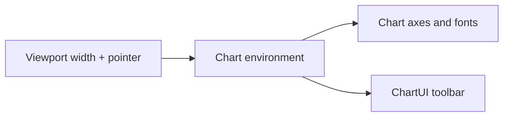

import GettingStartedDemo from "@site/src/components/GettingStartedDemo";
import ChartEnvironmentGenerated from "./_generated/chart-environment-api.mdx";

# Chart environment and layout

The chart watches the **viewport** and **pointer type** (mouse vs finger) and picks a **layout mode**. That changes axis width, font size, and hit targets — especially on phones.

You touch this layer when:

- the chart looks cramped on mobile
- you need to hide custom UI when `isCompact` is true
- you want one global breakpoint for chart + ChartUI

<GettingStartedDemo
  variant="react"
  caption="ChartUI and the chart engine share the same compact breakpoint (default 600px)."
/>

Guide with gestures and toolbar: [Mobile and responsive](../advanced/mobile-and-responsive). For the exact snapshot fields, see the [generated TypeScript reference](#full-api-generated-from-typescript) at the bottom of this page.

## The big picture



## Layout modes

| Mode | Typical situation |
| --- | --- |
| `desktop` | Wide screen + mouse |
| `compact` | Narrow width (≤ breakpoint, default 600px) |
| `touch` | Finger on a wide screen (tablet) |

Set behavior at create time:

```ts
import { createChart, CHART_COMPACT_BREAKPOINT_PX } from "@efixdata/exeria-chart";

const chart = createChart({
  container,
  layout: {
    mode: "auto", // recommended
    breakpoints: { compact: CHART_COMPACT_BREAKPOINT_PX }, // 600
  },
});
```

| `mode` value | Meaning |
| --- | --- |
| `"auto"` | Pick desktop / compact / touch from media queries |
| `"desktop"` | Force desktop metrics |
| `"compact"` | Force compact metrics |
| `"touch"` | Force touch-oriented metrics |

Override on the instance:

```ts
chart.setLayoutMode("desktop"); // lock desktop until you set "auto" again
chart.setLayoutMode("auto");
```

Each `fit()` applies compact axis metrics when the effective mode is `compact`.

## Environment snapshot

`chart.getChartEnvironment()` returns:

```ts
interface ChartEnvironmentSnapshot {
  layoutMode: "desktop" | "compact" | "touch";
  isCompact: boolean;
  isTouch: boolean;
  isCoarsePointer: boolean;
  isNarrowViewport: boolean;
  hitTolerance: number;      // px — easier taps on touch
  compactBreakpoint: number; // px — usually 600
}
```

| Field | Plain English |
| --- | --- |
| `layoutMode` | Current mode name |
| `isCompact` | `true` when narrow layout is active |
| `isTouch` | Coarse pointer or touch-capable environment |
| `isCoarsePointer` | Finger/stylus, not precise mouse |
| `isNarrowViewport` | Width ≤ compact breakpoint |
| `hitTolerance` | How far from a line you can tap to select it |
| `compactBreakpoint` | Width threshold in pixels |

## Subscribe to changes

```ts
chart.subscribe("ENVIRONMENT_CHANGE", (env) => {
  console.log(env.layoutMode, env.isCompact);
});
```

Use this to resize **your** headers, side panels, or legends when the user rotates the phone.

## Global configuration (all charts)

Module-level helpers affect every chart unless overridden per instance:

```ts
import {
  configureChartEnvironment,
  getChartEnvironment,
  subscribeChartEnvironment,
} from "@efixdata/exeria-chart";

configureChartEnvironment({ compactBreakpoint: 640 });

const snapshot = getChartEnvironment();

const unsubscribe = subscribeChartEnvironment(() => {
  console.log(getChartEnvironment());
});
```

| When to use | Approach |
| --- | --- |
| One app-wide breakpoint | `configureChartEnvironment` |
| Single chart different breakpoint | `createChart({ layout: { breakpoints: { compact: 720 } } })` |
| ChartUI + engine in sync | Same value on `ChartUI compactBreakpoint` |

`getChartEnvironment(override?)` accepts an optional per-call override (used inside `Chart.getChartEnvironment()`).

## Constants

```ts
import { CHART_COMPACT_BREAKPOINT_PX } from "@efixdata/exeria-chart";
// 600 — matches ChartUI --ui-mobile-breakpoint
```

## Layout types (TypeScript)

```ts
type ChartLayoutMode = "desktop" | "compact" | "touch";
type ChartLayoutModeOverride = "auto" | ChartLayoutMode;

interface ChartLayoutOptions {
  mode?: ChartLayoutModeOverride;
  breakpoints?: { compact?: number };
}
```

`ChartOptions.layout` accepts `ChartLayoutOptions`.

## Advanced exports (custom hosts)

If you build your own chart shell:

```ts
import {
  applyResponsiveChartLayout,
  COMPACT_CHART_LAYOUT,
  DESKTOP_CHART_LAYOUT,
  getLegendLayoutMetrics,
  isModelCompactLayout,
} from "@efixdata/exeria-chart";
```

`COMPACT_CHART_LAYOUT` and `DESKTOP_CHART_LAYOUT` document margin and axis values applied in each mode.

## Legacy helpers (avoid in new code)

Still exported for backward compatibility — prefer `getChartEnvironment()`:

| Helper | Note |
| --- | --- |
| `isTouchDevice()` / `isTouchEnvironment()` | Use `env.isTouch` |
| `isSmallScreen()` | Cached media query |
| `hitTolerance` / `getHitTolerance()` | Use `env.hitTolerance` |

## React UI helpers

From `@efixdata/exeria-chart-ui-react`:

```ts
import {
  useChartEnvironment,
  applyChartUiEnvironmentOptions,
  getChartUiSafeAreaPadding,
  syncChartInstanceLayout,
  isChartUiFullscreenElement,
  type ChartUIMobileLayout,
} from "@efixdata/exeria-chart-ui-react";

applyChartUiEnvironmentOptions({ compactBreakpoint: 600 });

function MyChrome() {
  const { isCompact, layoutMode, isTouch } = useChartEnvironment();
  return isCompact ? <CompactHeader /> : <DesktopHeader />;
}
```

| Export | Purpose |
| --- | --- |
| `useChartEnvironment()` | React hook for snapshot fields |
| `applyChartUiEnvironmentOptions()` | Set UI breakpoint globally |
| `syncChartInstanceLayout()` | Manually sync chart after UI change |
| `getChartUiSafeAreaPadding()` | Read safe-area padding values |
| `isChartUiFullscreenElement()` | Detect fullscreen container |

## Quick troubleshooting

| Problem | Fix |
| --- | --- |
| ChartUI compact but axes still desktop | `chart.setLayoutMode("auto")` — ChartUI does this on mount |
| Breakpoint 640 in app, 600 in chart | Align `configureChartEnvironment`, `createChart layout`, and `ChartUI compactBreakpoint` |
| Custom legend overlaps axis | Check `getLegendLayoutMetrics()` in compact mode |

<ChartEnvironmentGenerated />

## What is next?

- [Mobile and responsive](../advanced/mobile-and-responsive) — viewport, gestures, ChartUI props
- [ChartInstance](./chart-instance) — `setLayoutMode`, related methods
- [Mobile QA checklist](../guides/mobile-qa-checklist)
