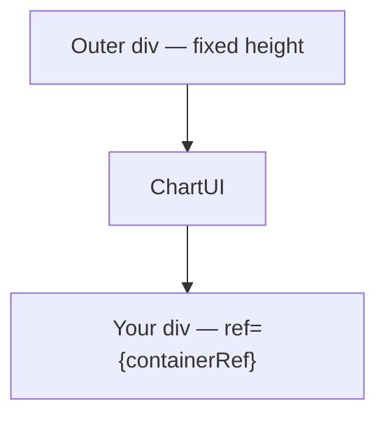

import GettingStartedDemo from "@site/src/components/GettingStartedDemo";
import ChartUiGenerated from "./_generated/chart-ui-api.mdx";

# ChartUI

**ChartUI** is the React wrapper from `@efixdata/exeria-chart-ui-react`. It renders the top toolbar, left drawing menu, and settings dialogs around a `ChartInstance`.

```tsx
import ChartUI from "@efixdata/exeria-chart-ui-react";
import { createChart, type ChartInstance } from "@efixdata/exeria-chart";
```

Use this page as a **lookup table**. The [generated TypeScript reference](#full-api-generated-from-typescript) at the bottom lists every public export from `@efixdata/exeria-chart-ui-react`. For layout pitfalls and SSR, see [React UI integration](../advanced/react-ui-integration). For toolbar behavior, see [React UI toolbar and tools](../advanced/react-ui-toolbar-and-tools).

<GettingStartedDemo
  variant="react"
  caption="ChartUI wraps your chart div — props below control this chrome."
/>

## Component props

```tsx
<ChartUI
  chart={chartInstance}
  loading={false}
  leftMenuWidth={44}
  topMenuHeight={40}
  onIntervalChange={(symbol) => void reload(symbol)}
  theme={uiTheme}
  shareConfig={shareConfig}
  mobileLayout="default"
  compactBreakpoint={600}
>
  <div ref={containerRef} style={{ width: "100%", height: "100%" }} />
</ChartUI>
```

| Prop | Type | Default | What it does |
| --- | --- | --- | --- |
| `chart` | `ChartInstance \| null \| undefined` | — | **Required.** Pass `null` while creating the engine in `useEffect` |
| `children` | `ReactNode` | — | Chart container `<div>` — must be nested **inside** ChartUI |
| `loading` | `boolean` | `false` | Shows loading state on toolbar while data fetches |
| `leftMenuWidth` | `number` | `44` | Left drawing rail width (px) |
| `topMenuHeight` | `number` | `40` | Top toolbar height (px) |
| `onIntervalChange` | `(symbol: string) => void` | — | Fired when user picks a new interval from the toolbar |
| `theme` | `ChartUITheme` | built-in dark preset | Colors for toolbar, dialogs, inputs — **not** candle colors |
| `shareConfig` | `ShareConfig` | — | Share menu URLs, templates, watermark for image export |
| `mobileLayout` | `"default" \| "minimal"` | `"default"` | `"minimal"` hides secondary toolbar groups on compact layouts |
| `compactBreakpoint` | `number` | `600` | Viewport width (px) where compact layout activates |

### Nullable `chart`

ChartUI accepts `chart={null}` during bootstrap. The toolbar shell mounts immediately; controls wire up when you `setChart(instance)` after `setMainSeriesData`.

## `ChartUITheme`

Styles **UI chrome** only. Candle and axis colors come from `createChart({ theme, themeVariant })`.

```tsx
import type { ChartUITheme } from "@efixdata/exeria-chart-ui-react";
```

| Key | Purpose |
| --- | --- |
| `border.inner` / `border.outter` / `border.radius` | Chrome frame |
| `gap` | Spacing between UI regions |
| `edgeInset` | Padding between chart surround and container edges |
| `surroundBackground` | Background behind toolbars (not the plot canvas) |
| `accentColor` | Primary accent for UI controls |
| `buttons` | Default button colors (normal, hover, active) |
| `radioButton` | Radio group styling |
| `toolbar` | Top bar — see toggles below |
| `subMenu` | Nested menu panels |
| `splitButton` | Split button open/hover states |
| `dialog` | Settings and indicator dialog colors |
| `inputs` | Form fields inside dialogs |
| `scrollBar` | Scrollbar track and thumb |

### Toolbar toggles (`theme.toolbar`)

| Field | Effect |
| --- | --- |
| `background` | Top bar background color |
| `showShareChartButton` | Show/hide share menu |
| `showChartScaleSwitch` | Show/hide linear / log / % switch |
| `showCurrency` | Show/hide currency label |
| `topMenuPosition` | `"right"` for right-aligned toolbar variant |
| `buttons` | Override button states for toolbar only |

`subMenu`, `splitButton`, `dialog`, `inputs`, and `scrollBar` are **required keys** on `ChartUITheme` when you pass a full custom theme object — copy from `DEFAULT_CHART_UI_THEME` or use `buildChartUiTheme()`.

## `ShareConfig`

| Field | Purpose |
| --- | --- |
| `apiUri` | Backend endpoint for share metadata (optional) |
| `templateText` | Default share text |
| `sourceUrl` | Canonical URL embedded in shares |
| `twitterTextTemplate` | Twitter-specific template |
| `telegramTextTemplate` | Telegram-specific template |
| `watermarkSvg` | SVG string for downloaded chart image |
| `watermarkDataUrl` | Data URL alternative to SVG watermark |

## Exported hooks

### `useChartEnvironment()`

Subscribes to global chart environment (viewport width, compact mode, pointer type). Re-renders on breakpoint or pointer changes.

```tsx
import { useChartEnvironment } from "@efixdata/exeria-chart-ui-react";

function MyHeader() {
  const { isCompact, isTouch, layoutMode, compactBreakpoint } = useChartEnvironment();
  return isCompact ? <CompactHeader /> : <DesktopHeader />;
}
```

Returns `ChartEnvironmentSnapshot` from `@efixdata/exeria-chart` — same shape as `chart.getChartEnvironment()`.

### `useChartTranslate()`

Resolves UI strings using the chart locale catalog. Use when building custom React chrome that should match ChartUI language.

## Exported utilities

| Export | Purpose |
| --- | --- |
| `applyChartUiEnvironmentOptions(options)` | Apply global UI environment (breakpoint) before mount |
| `syncChartInstanceLayout(chart)` | Sync chart engine layout mode with current environment |
| `getChartUiSafeAreaPadding(environment)` | Padding for overlay left menu in compact mode |
| `isChartUiFullscreenElement(element)` | Detect fullscreen chart shell |
| `DEFAULT_CHART_UI_THEME` | Default dark `ChartUITheme` object |
| `CHART_SETTINGS_PRESETS` | Named chart + UI preset bundles |
| `DEFAULT_CHART_SETTINGS_TEMPLATE` | Default settings JSON template |
| `buildChartUiTheme(partial)` | Merge partial theme onto defaults |

Import path:

```ts
import ChartUI, {
  DEFAULT_CHART_UI_THEME,
  buildChartUiTheme,
  useChartEnvironment,
} from "@efixdata/exeria-chart-ui-react";
```

## Layout contract



| Mistake | Symptom | Fix |
| --- | --- | --- |
| No height on outer wrapper | Toolbar OK, plot height 0 | `style={{ height: 560 }}` on wrapper |
| Chart div outside ChartUI | Broken layout | Nest div inside `<ChartUI>` |
| Flex parent without `min-height: 0` | Squashed on mobile | Add to flex children |

## Breakpoint alignment

Keep chart engine and ChartUI on the same compact breakpoint:

```tsx
<ChartUI chart={chart} compactBreakpoint={640}>
  <div ref={containerRef} style={{ width: "100%", height: "100%" }} />
</ChartUI>
```

```ts
createChart({
  container,
  layout: { mode: "auto", breakpoints: { compact: 640 } },
});
```

Full types: [Chart environment and layout](./chart-environment).

## Events ChartUI listens to

ChartUI subscribes to `ChartInstance` events internally (`INDICATOR_EDIT_REQUEST`, `DRAWING_EDIT_REQUEST`, `ENVIRONMENT_CHANGE`, …). Your app can subscribe to the same topics to sync external UI — see [ChartInstance → Events](./chart-instance#events).

## What ChartUI does not support today

- Injecting custom buttons into the middle of the built-in top toolbar
- Replacing the left drawing menu with arbitrary React components (build custom chrome with core-only `createChart` instead)

<ChartUiGenerated />

## Related pages

- [React UI integration](../advanced/react-ui-integration) — nullable chart, SSR, two theme systems
- [React UI toolbar and tools](../advanced/react-ui-toolbar-and-tools) — interval callback, share, drawing menu
- [Top toolbar and mobile](../chart-usage/top-toolbar-and-mobile) — end-user toolbar behavior
- [ChartInstance](./chart-instance) — data and settings API underneath ChartUI
