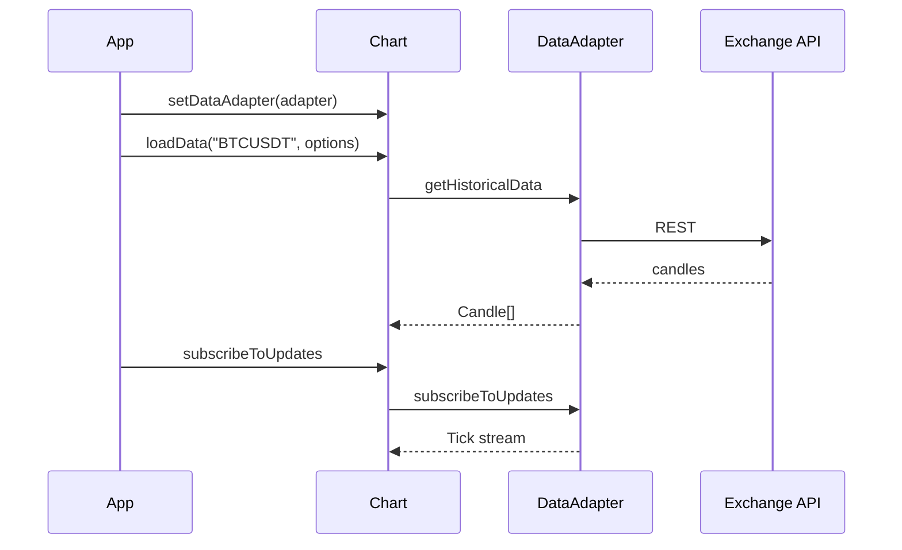

import BinanceConnectorExample from "@site/src/components/BinanceConnectorExample";

# Data Connectors (API)

A **Data Connector** is an npm package that fetches market data for you. The chart talks to it through one TypeScript interface: **`DataAdapter`**.

This page is the **type reference**. For install steps and examples, see [Data connectors](../data-connectors/).

<BinanceConnectorExample />

## Mental model



Your app never parses raw exchange JSON — the adapter returns **`Candle[]`** and **`Tick`** objects the chart already understands.

## Import types

```ts
import type {
  Candle,
  Tick,
  DataAdapter,
  LoadDataOptions,
} from "@efixdata/exeria-chart";

import { intervalFromSymbol, milisFromIntervalSymbol } from "@efixdata/exeria-chart";
```

## DataAdapter — the contract

Every connector must implement:

```ts
interface DataAdapter {
  initialize(config: Record<string, unknown>): Promise<void>;
  getHistoricalData(symbol: string, options: LoadDataOptions): Promise<Candle[]>;
  getCurrentPrice(symbol: string): Promise<Tick>;
  subscribeToUpdates(
    symbol: string,
    callback: (update: Tick) => void,
  ): () => void;
  disconnect(): Promise<void>;
}
```

### Method guide

| Method | When it runs | Your job as connector author |
| --- | --- | --- |
| `initialize(config)` | Once at startup | Read API keys, base URL, timeouts |
| `getHistoricalData(symbol, options)` | User opens chart / changes interval | Return candles **oldest → newest** |
| `getCurrentPrice(symbol)` | Optional spot check | Latest price as `Tick` |
| `subscribeToUpdates(symbol, callback)` | Live mode | Push ticks; return `unsubscribe` function |
| `disconnect()` | App teardown | Close sockets, clear state |

The symbol is always passed **separately** — ticks do not need to repeat it inside every update.

## ChartInstance connector methods

The chart wraps the adapter with convenience methods:

| Method | What it does |
| --- | --- |
| `setDataAdapter(adapter)` | Attach connector (constructor option or later) |
| `loadData(symbol, options)` | Calls `getHistoricalData` → `setMainSeriesData` |
| `subscribeToUpdates(symbol, callback?)` | Starts live stream → `appendTick` |
| `unsubscribeFromUpdates()` | Stops stream |
| `getCurrentPrice()` | `Tick \| null` from last update |

```ts
const chart = createChart({ container, dataAdapter: connector });
chart.init();

await chart.loadData("BTCUSDT", { interval: "1h", limit: 1000 });

chart.subscribeToUpdates("BTCUSDT", (tick) => {
  console.log(tick.c ?? tick.price);
});
```

Full `ChartInstance` list: [ChartInstance](./chart-instance).

## LoadDataOptions

```ts
interface LoadDataOptions {
  interval: string;   // required — e.g. "1h", "1d", "1w"
  from?: Date;
  to?: Date;
  limit?: number;
}
```

| Field | Meaning |
| --- | --- |
| `interval` | Timeframe symbol — chart resolves via `intervalFromSymbol()` |
| `from` / `to` | Optional date range |
| `limit` | Max candles when no date range (most recent N) |

```ts
await chart.loadData("ETHUSDT", {
  interval: "4h",
  limit: 500,
});

await chart.loadData("AAPL", {
  interval: "1d",
  from: new Date("2024-01-01"),
  to: new Date("2024-12-31"),
});
```

Common interval symbols: `"1m"`, `"5m"`, `"1h"`, `"4h"`, `"1d"`, `"1w"`, `"1M"`.

```ts
const interval = intervalFromSymbol("1h");
// { symbol: "1h", milis: 3600000 }
```

## Candle (historical bar)

Same type as `setMainSeriesData()`:

```ts
interface Candle {
  o: number;       // open
  h: number;       // high
  l: number;       // low
  c: number;       // close
  stamp: number;   // Unix time in milliseconds
  v?: number;      // volume (optional)
}
```

Rules connectors should follow:

- `stamp` must be unique per bar for a symbol+interval
- Sort ascending by `stamp`
- Use numbers, not strings, for OHLC

Details: [Data model](../core-concepts/data-model).

## Tick (live update)

Same type as `appendTick()`:

```ts
interface Tick {
  stamp: number;
  o?: number;
  h?: number;
  l?: number;
  c?: number;
  v?: number;
  price?: number;
}
```

| Tick shape | Chart behavior |
| --- | --- |
| Has `o`, `h`, `l`, `c` | Upsert current candle |
| Only `price` or `c` | Append price update to form/update bar |

Guide: [Realtime updates](../chart-usage/realtime-updates).

## Built-in connectors

| Package | Doc |
| --- | --- |
| `@efixdata/connector-binance` | [Binance](../data-connectors/binance) · [live demo](/binance-example) |
| `@efixdata/connector-bybit` | [Bybit](../data-connectors/bybit) · [live demo](/bybit-example) |
| `@efixdata/connector-okx` | [OKX](../data-connectors/okx) · [live demo](/okx-example) |
| `@efixdata/connector-kraken` | [Kraken](../data-connectors/kraken) · [live demo](/kraken-example) |
| `@efixdata/connector-kucoin` | [KuCoin](../data-connectors/kucoin) · [live demo](/kucoin-example) |
| `@efixdata/connector-coinbase` | [Coinbase](../data-connectors/coinbase) · [live demo](/coinbase-example) |
| `@efixdata/connector-gate` | [Gate.io](../data-connectors/gate) · [live demo](/gate-example) |
| `@efixdata/connector-ccxt` | [CCXT (multi-exchange)](../data-connectors/ccxt) · [live demo](/ccxt-example) |
| `@efixdata/connector-twelve-data` | [Twelve Data](../data-connectors/twelve-data) · [live demo](/twelve-data-example) |
| `@efixdata/connector-finage` | [Finage](../data-connectors/finage) · [live demo](/finage-example) |
| `@efixdata/connector-finnhub` | [Finnhub](../data-connectors/finnhub) · [live demo](/finnhub-example) |
| `@efixdata/connector-eodhd` | [EODHD](../data-connectors/eodhd) · [live demo](/eodhd-example) |
| `@efixdata/connector-massive` | [Massive](../data-connectors/massive) · [live demo](/massive-example) |
| `@efixdata/connector-coingecko` | [CoinGecko](../data-connectors/coingecko) · [live demo](/coingecko-example) |

## Build your own connector

Implement `DataAdapter`, publish an npm package, then:

```ts
chart.setDataAdapter(new MyAdapter());
await chart.loadData("MY_SYMBOL", { interval: "1h", limit: 300 });
```

Checklist: [Overview → build your own](../data-connectors/overview#build-your-own-connector).

## Quick troubleshooting

| Problem | Check |
| --- | --- |
| `loadData` throws | `initialize()` called? Symbol valid for provider? |
| Candles out of order | Sort ascending by `stamp` |
| Live bar jumps | Tick missing `stamp` or duplicate stamps |
| Switch symbol stuck | `unsubscribeFromUpdates()` before new `loadData` |
| Type not found | Import from `@efixdata/exeria-chart`, not from adapter |

## What is next?

- [Data connectors hub](../data-connectors/) — beginner overview
- [Binance connector](../data-connectors/binance) — ready-to-use example
- [Bybit connector](../data-connectors/bybit) — ready-to-use example
- [OKX connector](../data-connectors/okx) — ready-to-use example
- [Kraken connector](../data-connectors/kraken) — ready-to-use example
- [KuCoin connector](../data-connectors/kucoin) — ready-to-use example
- [Coinbase connector](../data-connectors/coinbase) — ready-to-use example
- [Loading data](../chart-usage/loading-data) — manual API path without connector
- [ChartInstance](./chart-instance) — all chart methods
