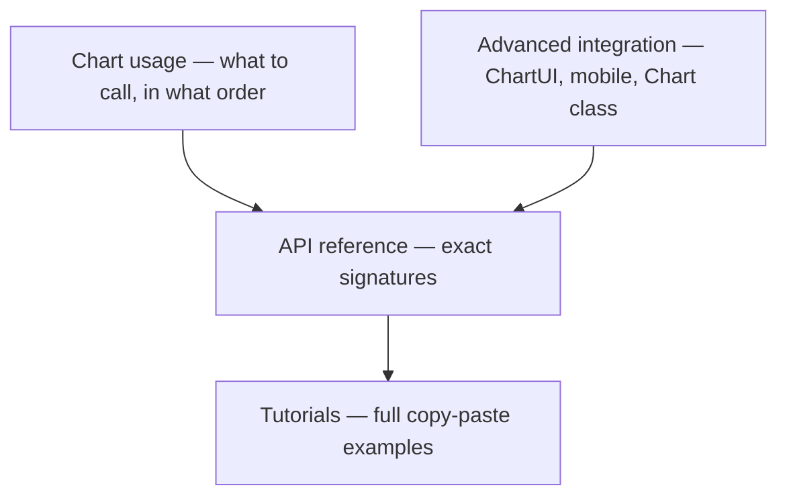

import GettingStartedDemo from "@site/src/components/GettingStartedDemo";
import BinanceConnectorExample from "@site/src/components/BinanceConnectorExample";

# API reference

You learned the **ideas** in [Core concepts](../core-concepts/) and the **daily tasks** in [Chart usage](../chart-usage/). **API reference** is the lookup layer — exact method names, types, and return values when you code or ask your AI assistant.

[ChartInstance](./chart-instance), [Chart environment](./chart-environment), and [ChartUI](./chart-ui) include **TypeScript-synced** API tables (regenerated on every docs build) from `packages/chart` and `packages/react-chart-ui`.

No need to read this cover to cover. Open the page that matches your question.

<GettingStartedDemo
  variant="vanilla"
  caption="Every method below belongs to the chart instance returned by createChart()."
/>

## Pick your page

| You want to… | Read |
| --- | --- |
| Look up a method on the chart (`setMainSeriesData`, `appendTick`, settings, …) | [ChartInstance](./chart-instance) |
| ChartUI props, theme tokens, hooks (`useChartEnvironment`, …) | [ChartUI](./chart-ui) |
| Compact layout, breakpoints, `ENVIRONMENT_CHANGE` | [Chart environment and layout](./chart-environment) |
| Build or wire a Data Connector (`DataAdapter`, `loadData`, …) | [Data Connectors](./data-connectors) |

## How this relates to other sections



| Section | Role |
| --- | --- |
| [Chart usage](../chart-usage/) | Explains **tasks** in plain language |
| [Advanced integration](../advanced/) | **ChartUI**, mobile, runtime gaps |
| **API reference** (here) | **Method and type** cheat sheet |
| [Tutorials](../tutorials/) | End-to-end recipes |

## The one object you hold

Almost everything goes through **`ChartInstance`** — the return value of `createChart()`:

```ts
import { createChart } from "@exeria/charts";

const chart = createChart({ container });
chart.init();
await chart.setMainSeriesData(candles, interval);
```

Import types from the same package:

```ts
import type {
  Candle,
  Tick,
  Interval,
  Instrument,
  ChartInstance,
  DataAdapter,
  LoadDataOptions,
} from "@exeria/charts";
```

## Data connectors in one glance

Connectors implement **`DataAdapter`**. The chart wraps them with `setDataAdapter`, `loadData`, and `subscribeToUpdates`:

<BinanceConnectorExample />

Types and contract: [Data Connectors](./data-connectors). Beginner guide: [Data connectors overview](../data-connectors/overview).

## Quick lookup — most-used methods

| Task | Method |
| --- | --- |
| First paint | `init()` → `setMainSeriesData()` |
| Live price | `appendTick()` or `subscribeToUpdates()` |
| Scroll / fit | `fit()` |
| Linear / log scale | `setValueAxisMode("lin" \| "log" \| "%")` |
| Add indicator | `addScript("SMA", …)` |
| Draw a line | `toolDrawer.drawTrendLine()` |
| Save user prefs | `exportChartSettingsTemplate()` |
| Cleanup | `destroy()` |

Full grouped list: [ChartInstance](./chart-instance).

## What is not on ChartInstance

Some runtime methods exist only on the exported **`Chart` class** (`moveToStamp`, `addPanelToModel`, …). See [Chart runtime access](../advanced/chart-class-runtime).

## Quick troubleshooting

| Problem | Check |
| --- | --- |
| TypeScript says method missing | You may need `Chart` class — [runtime access](../advanced/chart-class-runtime) |
| `loadData` types confusing | [Data Connectors](./data-connectors) + `LoadDataOptions` |
| Layout mode not updating | [Chart environment](./chart-environment) — `setLayoutMode`, `ENVIRONMENT_CHANGE` |
| Event payload shape | [ChartInstance → Events](./chart-instance#events) |

Ready? Open [ChartInstance](./chart-instance) or jump to the topic you need.
