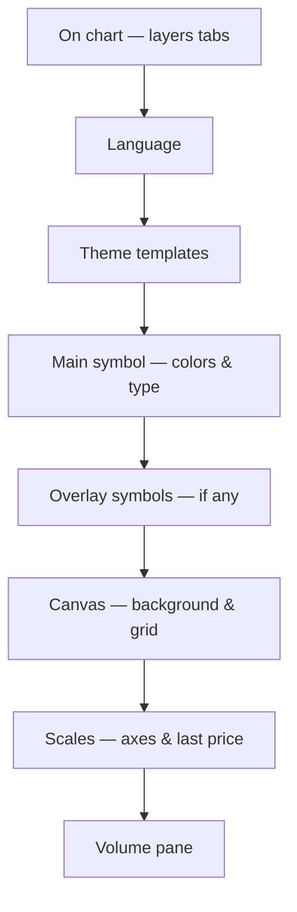

import GettingStartedDemo from "@site/src/components/GettingStartedDemo";

# Chart settings

The **Chart settings** dialog (gear icon on desktop, **⋯ → Chart settings** on mobile) is where users customize how the chart **looks** and which **layers** are visible — without writing code.

<GettingStartedDemo
  variant="react"
  caption="Open the gear icon (or ⋯ on mobile) to explore these options on a live chart."
/>

Tutorial for saving settings: [Save and restore settings](../tutorials/save-and-restore-settings).  
Toolbar placement: [Top toolbar and mobile](./top-toolbar-and-mobile).

---

## How to open it

| Screen | Path |
| --- | --- |
| Desktop | Top toolbar → **gear** icon |
| Mobile (compact) | Top toolbar → **⋯** → **Chart settings** |

Tap **OK** at the bottom to close. Changes apply immediately — no separate Save button.

---

## Dialog map

The settings window is organized in **sections** from top to bottom:



---

## 1. On chart — layers (visibility)

The first section manages **what is drawn** on top of the candles. Four tabs:

| Tab | What it lists |
| --- | --- |
| **Indicators** | EMA, RSI, MACD, … |
| **Functions** | Built-in function scripts on the chart |
| **Strategies** | Signal / strategy overlays |
| **Drawings** | Trend lines, Fibonacci, boxes, … |

Each tab shows a table. Column meanings depend on the tab:

### Indicators and functions

| Column | Icon | Meaning |
| --- | --- | --- |
| **Name** | — | Script title |
| **Plot** (eye) | 👁 | Show or hide the script **on the chart** |
| **Scale** (eye) | 👁 | Show or hide the **price label** on the Y axis for that script |
| **Remove** | 🗑 | Delete the script from the chart |

**Plot vs scale — plain English:**

- Turn **Plot** off → the line or histogram disappears, but the script may still run in the background.
- Turn **Scale** off → the script may still draw, but its price tag on the right axis is hidden. Useful when many indicators crowd the scale.

### Strategies

| Column | Meaning |
| --- | --- |
| **Name** | Strategy title |
| **Visible** | Show or hide strategy markers / overlays |
| **Remove** | Remove strategy from chart |

Strategies do not have a separate “scale label” column — only visibility on the chart.

### Drawings

| Column | Meaning |
| --- | --- |
| **Name** | Tool label (e.g. “Trend line”, “Fibonacci retracement”) |
| **Visible** | Show or hide that shape |
| **Remove** | Delete the drawing |

At the top of the Drawings tab:

- **Lock all / Unlock all** — prevent accidental drags (drawings stay visible but anchors cannot move until unlocked).

Empty tab? You see a short message — add an indicator from the toolbar or draw something on the chart first.

### Programmatic equivalent (integrators)

```ts
chart.setChartIndicatorVisibility(scriptId, false);
chart.setChartIndicatorPriceTagVisibility(scriptId, false);
chart.setChartFunctionVisibility(scriptId, true);
chart.setChartStrategyVisibility(scriptId, false);
chart.setChartDrawingVisibility(objectId, false);
chart.lockAllDrawings();
```

Lists for your own UI: `getChartIndicatorSettings()`, `getChartFunctionSettings()`, `getChartStrategySettings()`, `getChartDrawingSettings()`.

---

## 2. Language

Dropdown of **supported locales** for chart chrome and script labels (menus, dialogs, indicator names).

| What changes | What does not |
| --- | --- |
| UI strings, localized indicator titles | Your app’s own buttons outside ChartUI |
| Number/date formatting where the runtime localizes | Symbol names from your data feed |

```ts
chart.setLocale("pl-PL");
chart.getLocale();
```

The settings dialog reads `chart.getSupportedLocales()` for the option list.

---

## 3. Theme templates

A grid of **preset themes** — one tap applies a full look:

- Background, candle up/down colors, grid, toolbar chrome
- Matching UI theme for dialogs and menus

Presets include trading-dark, light, and other bundled styles. After you pick a preset, individual color tweaks below still work — picking a preset again overwrites with that bundle.

Save a user’s final look: [Save and restore settings](../tutorials/save-and-restore-settings) (`exportChartSettingsTemplate`).

---

## 4. Main symbol — chart type and colors

Controls the **primary** instrument (first symbol on the chart).

| Field | What it does |
| --- | --- |
| **Chart type** | OHLC candles, bars, line, histogram, line + histogram |
| **Chart line** | Line color (line modes) |
| **Line style** | Solid, dashed, dotted, … |
| **Line fill** | Fill color under a line chart |
| **Fill gradient** | Second color + opacity for gradient fill |
| **Fill mode** | Solid or gradient |
| **Show area under line** (eye) | Toggle fill under the main line on/off |
| **Candle up / down** | Body colors |
| **Up / down stroke** | Wick and border colors |

On **overlay** charts (two symbols), this section is labeled with the **main** symbol name. Each extra symbol gets its own section below with line color, style, and chart type.

```ts
chart.applyChartAppearanceSettings({ candleUpColor: "#25ad98", /* … */ });
chart.applyChartInstrumentSettings(seriesId, { lineColor: "#f0b429", lineDash: [4, 4] });
```

---

## 5. Canvas — background and grid

| Field | What it does |
| --- | --- |
| **Plot background** | Color behind the candles |
| **Grid** | Grid line color |
| **Grid lines** | Both axes, horizontal only, vertical only, or hidden |
| **Line style** | Solid or dashed grid |
| **Show grid** (toggle) | Master on/off for the grid |

Hiding the grid does not remove axes — only the inner grid lines.

---

## 6. Scales — axes and last price

| Field | What it does |
| --- | --- |
| **Axis labels** | Text color on price and time axes |
| **Axis background** | Background behind axis labels |
| **Crosshair** | Crosshair line color |
| **Last price line** (toggle) | Horizontal line at the current price |
| **Last price label** (toggle) | Price tag on the Y axis at the last close |

These are the settings traders often call “show last price” or “price line”:

- **Last price line** → colored horizontal ray following the market.
- **Last price label** → numeric label on the scale (can use one without the other).

```ts
chart.applyChartAppearanceSettings({
  lastPriceLineVisible: true,
  lastPriceLabelVisible: true,
});
```

Related toolbar controls (autoscale, Lin/Log/%) live on the top bar: [Autoscale and value axis](./autoscale-and-value-axis).

---

## 7. Volume pane

Only active when a **volume indicator** is on the chart. Otherwise you see a hint to add volume first.

| Field | What it does |
| --- | --- |
| **Show volume** (toggle) | Show or hide the volume pane |
| **Opacity** | Slider — how strong the volume bars look |
| **Bar colors** | Match candle colors, or single custom color |
| **Bar color** | Pick one color when “single color” mode is selected |

```ts
chart.applyChartVolumeSettings({
  visible: true,
  opacity: 0.7,
  colorMode: "candle",
});
```

---

## Settings vs toolbar — who does what?

| User goal | Use |
| --- | --- |
| Change timeframe | Top bar → **Interval** |
| Add RSI | Top bar → **Indicators** |
| Linear vs log scale | Top bar → **Scale** (or ⋯ on mobile) |
| Hide an indicator but keep it running | Chart settings → Layers → Indicators → Plot off |
| Hide indicator’s Y-axis tag only | Chart settings → Layers → Scale off |
| Change candle colors | Chart settings → Main symbol / Theme template |
| Hide last price line | Chart settings → Scales |
| Polish UI language | Chart settings → Language |

---

## Persist settings for your users

Export everything the dialog touches:

```ts
const template = chart.exportChartSettingsTemplate("user-workspace");
localStorage.setItem("chart-workspace", JSON.stringify(template));
```

Restore on next visit:

```ts
chart.importChartSettingsTemplate(JSON.parse(raw));
```

Layers (which indicators are visible) are partially separate — see [Save and restore settings](../tutorials/save-and-restore-settings) for drawings and script lists.

---

## Theming without opening the dialog

Integrators can set defaults at mount time:

```ts
const chart = createChart({
  container,
  theme: { background: "#0b0f17", candleUp: "#25ad98", candleDown: "#d12e59" },
  themeVariant: "dark",
});
```

```tsx
<ChartUI chart={chart} theme={{ accentColor: "#14f7ab", toolbar: { background: "#111827" } }} />
```

Playground: [Live theme creator](../theming/live-theme-creator).

---

## What is next?

- [Top toolbar and mobile](./top-toolbar-and-mobile) — pencil, overflow menu, fullscreen
- [Custom theme](../tutorials/custom-theme) — brand colors tutorial
- [ChartInstance reference](../api-reference/chart-instance) — all settings methods
