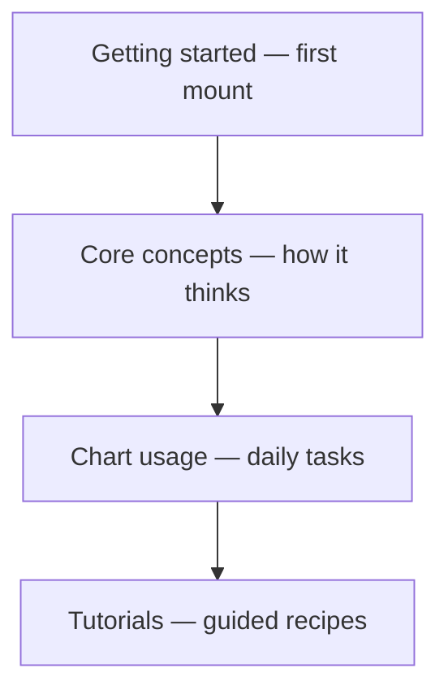

import GettingStartedDemo from "@site/src/components/GettingStartedDemo";

# Chart usage

You mounted a chart from [Getting started](../getting-started/). **Chart usage** is the practical layer — what you do every day: load history, stream prices, scroll around, change the scale, draw lines, compare two symbols.

Each page is standalone. Pick the task you are working on right now.

<GettingStartedDemo
  variant="vanilla"
  caption="Everything in this section builds on a running chart like this one."
/>

## Pick your page

| You want to… | Read |
| --- | --- |
| Load candles from your API or a connector | [Loading data](./loading-data) |
| Keep the chart moving with live prices | [Realtime updates](./realtime-updates) |
| Scroll, jump to a date, stay on the latest bar | [Navigation and viewport](./navigation-and-viewport) |
| Switch linear / log scale, toggle autoscale | [Autoscale and value axis](./autoscale-and-value-axis) |
| Draw lines in code or change crosshair mode | [Drawing and interaction](./drawing-and-interaction) |
| Show BTC and ETH on one chart | [Multi-instrument charts](./multi-instrument-charts) |
| Top bar buttons and mobile toolbar | [Top toolbar and mobile](./top-toolbar-and-mobile) |
| Language, colors, layers, last price | [Chart settings](./chart-settings) |

## How this relates to other sections

- **Core concepts** explain candles, lifecycle, draw modes.
- **Chart usage** (here) shows the **methods** for each task.
- **Tutorials** walk through full examples end to end.

## Two ways to get data

| Path | When |
| --- | --- |
| **Your API** | You control the backend — `setMainSeriesData`, `appendTick` |
| **Data Connector** | Public market feed (e.g. [Binance](../data-connectors/binance), [Bybit](../data-connectors/bybit), [OKX](../data-connectors/okx), [CoinGecko](../data-connectors/coingecko)) — `loadData`, `subscribeToUpdates` |

Both end up as candles on the same chart.

## Quick troubleshooting

| Problem | Page to check |
| --- | --- |
| Chart empty after fetch | [Loading data](./loading-data) — `init()` and candle shape |
| Last price not updating | [Realtime updates](./realtime-updates) — tick vs candle |
| Stuck on old bars | [Navigation and viewport](./navigation-and-viewport) — move to latest |
| Y axis keeps jumping | [Autoscale and value axis](./autoscale-and-value-axis) |
| Second symbol missing | [Multi-instrument charts](./multi-instrument-charts) |

Ready? Open [Loading data](./loading-data) or jump straight to what you need.
