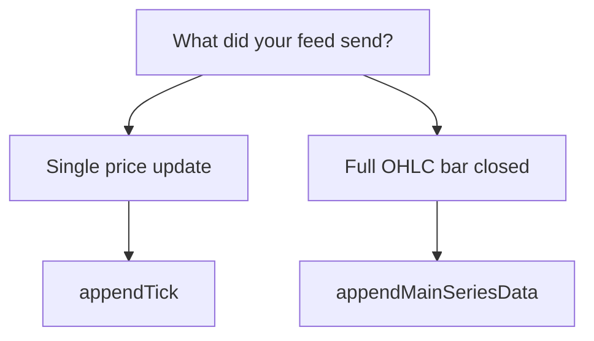

import TutorialChartDemo from "@site/src/components/TutorialChartDemo";

# Realtime updates

History gets you on screen. **Realtime updates** keep the chart honest as prices move — without refetching thousands of old candles.

<TutorialChartDemo
  scene="live-stream"
  caption="Preview: ticks arrive every second and update the last bar. Your feed can be WebSocket, polling, or a Data Connector."
/>

## Two kinds of live data

| What arrives | Method | Plain English |
| --- | --- | --- |
| **One price now** | `appendTick()` | “Last traded price just changed” |
| **One finished bar** | `appendMainSeriesData()` | “This hour’s candle just closed” |

Most apps use **ticks** during the session and **candles** when a bar completes.

---

## Append a single tick

```ts
chart.appendTick({
  stamp: Date.now(),
  price: 102.45,
  v: 120,
});
```

The chart updates the **current** candle or starts a new one based on `stamp` and your interval.

### From a WebSocket

```ts
socket.onmessage = (event) => {
  const tick = JSON.parse(event.data);

  chart.appendTick({
    stamp: tick.stamp,
    price: tick.price,
    v: tick.volume ?? 0,
  });
};
```

Tutorial walkthrough: [Live data stream](../tutorials/live-data-stream).

---

## Append many ticks at once

Bursts from a feed or replay? Batch them:

```ts
chart.appendTicks(ticks);
```

**Tip:** Very fast feeds (50+ per second) — batch in your app every ~100 ms, then call `appendTicks` once. Smoother chart, less CPU.

---

## Append a complete new candle

When your backend sends a **closed** bar:

```ts
chart.appendMainSeriesData([
  {
    stamp: 1715479200000,
    o: 103.9,
    h: 104.7,
    l: 103.4,
    c: 104.3,
    v: 2800,
  },
]);
```

Indicators recalculate automatically.

---

## Live data with a Data Connector

Skip manual `appendTick` — subscribe and let the connector push:

```ts
chart.subscribeToUpdates("BTCUSDT", (tick) => {
  console.log("Last:", tick.c);
});
```

Setup: [Connect with a Data Connector](../tutorials/connect-with-data-connector).

---

## Recalculate indicators on every tick?

By default, scripts may not rerun on every tiny tick (saves CPU). Pass `true` to force recalculation:

```ts
chart.appendTick({ stamp: Date.now(), price: 99.5 }, true);
```

Use when indicators must track every wiggle — otherwise leave the default.

---

## Clean up live connections

```ts
socket.close();
chart.destroy();
```

Always tear down WebSockets when the user leaves the page.

---

## Tick vs candle — decision tree



## What is next?

- [Navigation and viewport](./navigation-and-viewport) — keep the chart scrolled to the latest bar
- [Loading data](./loading-data) — initial history before you stream
- [Crypto terminal demo](/starters/crypto-terminal) — full live terminal
