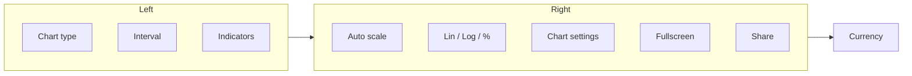

import GettingStartedDemo from "@site/src/components/GettingStartedDemo";

# Top toolbar and mobile

When you wrap your chart in **ChartUI**, users get a **top toolbar** — the horizontal bar above the candles. It controls chart type, timeframe, indicators, scale, and more.

<GettingStartedDemo
  variant="react"
  caption="Desktop-width ChartUI — full toolbar. Resize the browser below ~600px to see the compact mobile layout."
/>

This page is for **end users and integrators** who use ChartUI. If you mount `createChart()` alone, you build your own controls.

Requires: [React quickstart](../getting-started/react).

---

## What is on the toolbar?

### Desktop (wide screen)

Left to right, the bar is grouped like this:



| Control | What it does |
| --- | --- |
| **Chart type** | Candles, bars, line, histogram — same as `setMainDrawMode` |
| **Interval** | Switches timeframe (1m, 1h, 1d, …). Fires `onIntervalChange` so your app can load new data |
| **Indicators** | Opens the indicator / function / strategy catalog |
| **Auto scale** | Fits the Y axis to visible prices on or off |
| **Price scale** | Linear, logarithmic, or percent |
| **Chart settings** (gear) | Language, colors, layers, volume — [full guide](./chart-settings) |
| **Fullscreen** | Expands the chart to fill the screen |
| **Share** | Export or share snapshot (when enabled in theme) |
| **Currency** | Shows the instrument currency label (can be hidden via theme) |

### Left edge on mobile (compact bar)

On narrow screens (default: viewport **≤ 600px**), the toolbar switches to a **dense** layout:

| Position | Control |
| --- | --- |
| Far left | **Pencil** — show or hide the **drawing tools** rail on the chart edge |
| Center row | Chart type, interval, fullscreen |
| Far right | **⋯ overflow menu** |

The pencil does **not** appear on the wide desktop bar — drawing tools live in the **left vertical menu** beside the chart on desktop.

---

## The ⋯ overflow menu (mobile)

Tap **⋯** to reach controls that do not fit on a small screen:

| Item | Action |
| --- | --- |
| **Auto scale** | Toggle on/off (shows current state) |
| **Indicators** | Only when `mobileLayout="minimal"` — see below |
| **Price scale** | Submenu: Linear, Log, Percent |
| **Chart settings** | Opens the same dialog as the gear icon on desktop |
| **Share** | When `showShareChartButton` is enabled |
| **Currency** | Read-only label for the current currency |

On desktop, autoscale, scale, and settings stay as **visible buttons** — no overflow menu.

---

## Mobile layout modes

Pass `mobileLayout` to `ChartUI`:

```tsx
<ChartUI chart={chart} mobileLayout="default">
  <div ref={containerRef} style={{ width: "100%", height: "100%" }} />
</ChartUI>
```

| Value | Behavior |
| --- | --- |
| `"default"` | Compact bar shows **Indicators** button on the top row |
| `"minimal"` | Indicators hidden from the bar — open them only from **⋯ overflow** |

Use `"minimal"` for very narrow embeds (banking widgets, in-article charts) where every pixel counts.

### Sync breakpoint with the chart core

```tsx
<ChartUI chart={chart} compactBreakpoint={600}>
```

Default **600px** matches the chart’s compact layout (`CHART_COMPACT_BREAKPOINT_PX`). Below that width:

- Toolbar becomes dense (smaller padding, overflow menu).
- Chart axes and fonts use **compact** metrics automatically.

---

## Drawing tools on mobile

1. Tap the **pencil** on the compact toolbar.
2. A **drawing rail** slides over the chart edge — same tools as the desktop left menu.
3. Tap pencil again to hide the rail.

The page does **not** reflow sideways; the rail overlays the chart so your layout stays stable.

Magnet snap and lock-all for drawings: [Drawing tools overview](../drawing-tools/overview).

---

## Touch gestures on the chart (not the toolbar)

On phones and tablets, users interact with the **chart surface** directly:

| Gesture | Effect |
| --- | --- |
| **Drag** | Scroll left/right through history |
| **Pinch** | Zoom time axis |
| **Swipe** | Momentum scroll after release |
| **Long press** | Context menu — jump to start/end, toggle autoscale, toggle crosshair |

Crosshair stays visible after you lift your finger (**sticky crosshair**). Pinch or pan closes an open long-press menu.

Details: [Drawing and interaction](./drawing-and-interaction), [Mobile and responsive](../advanced/mobile-and-responsive).

---

## Fullscreen on mobile

Fullscreen expands the **ChartUI container**, not just the canvas. The runtime:

- Applies safe-area padding (`env(safe-area-inset-*)`) for notched phones.
- Uses `min-height: 100dvh` while fullscreen is active.
- Re-syncs layout when the browser chrome shows or hides (via `visualViewport`).

Your app should set the viewport meta tag:

```html
<meta name="viewport" content="width=device-width, initial-scale=1, viewport-fit=cover" />
```

---

## Hide or reposition toolbar parts (integrators)

Use `theme.toolbar` on `ChartUI`:

```tsx
<ChartUI
  chart={chart}
  theme={{
    toolbar: {
      showShareChartButton: false,
      showChartScaleSwitch: true,
      showCurrency: false,
      topMenuPosition: "right",
    },
  }}
>
  <div ref={containerRef} style={{ width: "100%", height: "100%" }} />
</ChartUI>
```

| Theme key | Effect |
| --- | --- |
| `showShareChartButton` | Show/hide share |
| `showChartScaleSwitch` | Show/hide Lin/Log/% switch |
| `showCurrency` | Show/hide currency label |
| `topMenuPosition` | `"right"` aligns the menu cluster to the right |

Full reference: [React UI toolbar and tools](../advanced/react-ui-toolbar-and-tools).

### Interval changes and your data

```tsx
<ChartUI
  chart={chart}
  onIntervalChange={(symbol) => {
    void loadCandles(symbol);
  }}
>
```

ChartUI does **not** fetch data for you — when the user picks a new interval, **you** load candles and call `setMainSeriesData`.

---

## Desktop vs mobile — quick comparison

| Feature | Desktop (wide) | Mobile (compact) |
| --- | --- | --- |
| Drawing tools | Left vertical menu | Pencil → overlay rail |
| Indicators | Top bar button | Top bar or ⋯ only (`minimal`) |
| Auto scale / scale / settings | Visible buttons | Mostly in ⋯ menu |
| Chart settings gear | Top bar | ⋯ → Chart settings |
| Currency | Far right of bar | ⋯ menu (read-only) |

---

## What is next?

- [Chart settings](./chart-settings) — language, colors, layers, volume
- [Autoscale and value axis](./autoscale-and-value-axis) — programmatic scale API
- [Mobile QA checklist](../guides/mobile-qa-checklist) — test before shipping
