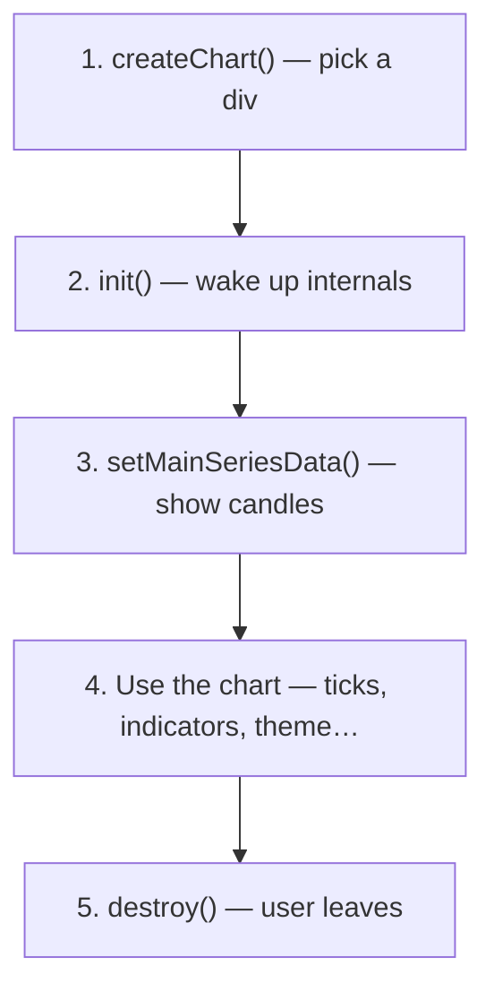

import GettingStartedDemo from "@site/src/components/GettingStartedDemo";

# Chart lifecycle

A chart is not magic — it goes through clear **stages**. Get the order right and everything else (live data, indicators, themes) slots in easily.

<GettingStartedDemo
  variant="vanilla"
  caption="End state after the lifecycle: create → init → load data."
/>

## The five stages



Think of it like starting a car: create the car, turn the key (`init`), drive (data + updates), park and turn off (`destroy`).

## Stage 1 — Create

Point the library at a DOM element:

```ts
import { createChart } from "@exeria/charts";

const container = document.getElementById("chart-root");

const chart = createChart({
  container,
  instrument: {
    symbol: "BTCUSD",
    currency: "USD",
    precision: 2,
  },
});
```

`instrument` is optional metadata — symbol name, how many decimal places to show. Helpful for labels and price formatting.

### `createChart` vs `new Chart`

| Approach | Who uses it |
| --- | --- |
| `createChart()` | **You** — typed public API, recommended |
| `new Chart()` | Advanced integrations that need extra runtime hooks |

Start with `createChart()`. You rarely need the class directly.

## Stage 2 — Init (do not skip)

```ts
chart.init();
```

`init()` builds canvases, hit-testing, and the internal model. **No init → no chart.**

Always call it **once**, **before** the first data load.

```ts
chart.init();
await chart.setMainSeriesData(candles, interval);
```

If you load data before `init()`, the runtime exits early — you get a blank chart with no obvious error.

## Stage 3 — Give the container size

Before or right after `init()`, make sure the div has height:

```ts
container.style.height = "480px";
chart.init();
```

The chart measures its parent. **Zero height = invisible chart.** This is the #1 beginner bug.

## Stage 4 — Load data and use the chart

```ts
await chart.setMainSeriesData(candles, interval);
```

Now you can:

- Change draw mode — `setMainDrawMode("Line")`
- Stream prices — `appendTick({ … })`
- Add indicators — `addScript("EMA")`
- Draw lines — `toolDrawer.drawTrendLine({ … })`

See [Data model](./data-model) for candle shape and [Tutorials](../tutorials/) for recipes.

## Stage 5 — Destroy on teardown

When the user navigates away or your React component unmounts:

```ts
chart.destroy();
```

This removes canvases, listeners, and observers. Without it, single-page apps can leak memory over long sessions.

### React pattern

```tsx
useEffect(() => {
  const instance = createChart({ container });
  instance.init();
  // … load data …

  return () => {
    instance.destroy(); // always in cleanup
  };
}, []);
```

## ChartUI does not replace the lifecycle

`ChartUI` (React wrapper) adds toolbar and menus. It does **not** create the chart for you.

Your job:

1. `createChart` + `init` + data in `useEffect`
2. Pass the instance to `<ChartUI chart={chart}>`
3. `destroy` in cleanup

Full React walkthrough: [React quickstart](../getting-started/react).

## Lifecycle checklist

| Step | Done? |
| --- | --- |
| Container has non-zero height | ☐ |
| `createChart({ container })` | ☐ |
| `init()` before first data | ☐ |
| `setMainSeriesData` or connector `loadData` | ☐ |
| `destroy()` on unmount | ☐ |

## What is next?

- [Data model](./data-model) — candles, ticks, intervals
- [Loading data](../chart-usage/loading-data) — all load and append methods
