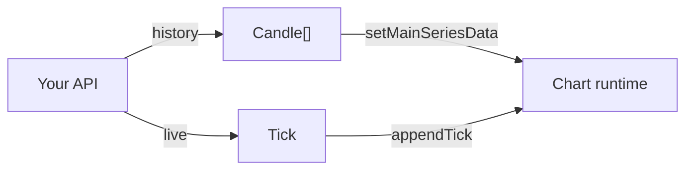

import TutorialChartDemo from "@site/src/components/TutorialChartDemo";

# Data model

The chart does not read your database directly. It expects data in a few simple **shapes**. If your API returns these fields, everything else tends to work.

<TutorialChartDemo
  scene="basic"
  caption="Each bar on this chart is one Candle object — six numbers and a timestamp."
/>

## The four building blocks

| Concept | One-line meaning |
| --- | --- |
| **Candle** | One bar of history (open, high, low, close) |
| **Tick** | One live price update |
| **Interval** | How long each candle lasts (1h, 1d, …) |
| **Instrument** | Symbol info (name, decimals, available timeframes) |

You use candles + interval for history. Ticks for live updates. Instrument for labels and formatting.

---

## Candle — one bar on the chart

A candle is a single time slice — like “what happened during this hour”:

```ts
type Candle = {
  stamp: number; // when the bar opens (UTC, milliseconds)
  o: number;     // open
  h: number;     // high
  l: number;     // low
  c: number;     // close
  v?: number;    // volume (optional — use 0 if missing)
};
```

Example:

```ts
const candle = {
  stamp: 1715472000000,
  o: 101.2,
  h: 103.1,
  l: 100.9,
  c: 102.8,
  v: 3200,
};
```

Load many candles at once:

```ts
await chart.setMainSeriesData([candle, /* … */], interval);
```

**Tip for your backend:** return JSON in exactly this shape. Your frontend can pass it straight through.

---

## Tick — one live price

When prices stream in (WebSocket, polling), you usually send **ticks**, not full candles:

```ts
type Tick = {
  stamp: number;
  price?: number;  // simple last price
  c?: number;      // same thing, alternate field name
  v?: number;
  o?: number;
  h?: number;
  l?: number;
};
```

```ts
chart.appendTick({
  stamp: Date.now(),
  price: 102.45,
  v: 120,
});
```

The chart merges ticks into the **current** candle or starts a new one based on `stamp` and your interval.

| Situation | Use |
| --- | --- |
| Initial page load | Candles → `setMainSeriesData` |
| Price just moved | Tick → `appendTick` |
| Bar fully closed | Candle → `appendMainSeriesData` |

Tutorial: [Live data stream](../tutorials/live-data-stream).

---

## Interval — candle length

Tells the chart how wide each bar is in time:

```ts
const interval = {
  symbol: "1h",              // label for UI ("1 hour")
  milis: 60 * 60 * 1000,     // length in milliseconds
};
```

Pass it with your data:

```ts
await chart.setMainSeriesData(candles, interval);
```

When the user switches from 1h to 1d, fetch new candles and call `setMainSeriesData` again with the new interval.

Common values:

| UI label | `symbol` | `milis` |
| --- | --- | --- |
| 5 minutes | `"5m"` | `5 * 60 * 1000` |
| 1 hour | `"1h"` | `60 * 60 * 1000` |
| 1 day | `"1d"` | `24 * 60 * 60 * 1000` |

---

## Instrument — symbol metadata

Describes **what** you are charting — not the prices themselves:

```ts
const instrument = {
  symbol: "BTCUSD",
  currency: "USD",
  precision: 2,
  availableIntervals: [
    { symbol: "5m", milis: 5 * 60 * 1000 },
    { symbol: "1h", milis: 60 * 60 * 1000 },
  ],
};
```

Set at create time or later:

```ts
const chart = createChart({ container, instrument });
// or
chart.setInstrument(instrument);
```

`precision` controls decimal places on the price axis. `availableIntervals` can populate your timeframe dropdown.

---

## Multiple symbols on one chart

Compare two assets (BTC vs ETH) on the same dates:

- First symbol = **main series** (usually candles).
- Others = **overlays** (usually lines).

Each symbol has its own id in `getSeriesManager()`. Style overlays with `getChartInstrumentSettings()` / `applyChartInstrumentSettings()`.

Tutorial: [Multi-instrument overlay](../tutorials/multi-instrument-overlay).  
Reference: [Multi-instrument charts](../chart-usage/multi-instrument-charts).

---

## Scripts and series (when you add indicators)

Indicators and strategies read from **series** — computed lines derived from price. You do not manage those arrays by hand at first:

```ts
chart.addScript("EMA");
chart.addScript("RSI");
```

Under the hood, `getScripts()` lists available recipes and `getSeriesManager()` holds the data. Explore when you customize indicators: [Customize a built-in indicator](../tutorials/customize-built-in-indicator).

---

## Data model cheat sheet



## What is next?

- [Rendering and scales](./rendering-and-scales) — candles vs line, linear vs log scale
- [Realtime updates](../chart-usage/realtime-updates) — tick behavior in detail
