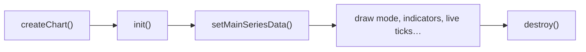

import GettingStartedDemo from "@site/src/components/GettingStartedDemo";

# Core concepts

You already mounted a chart from [Getting started](../getting-started/). These pages explain **how it thinks** — so when something looks wrong (blank box, wrong bar size, scale jumping), you know where to look.

No PhD required. We use everyday words first; exact API names come second.

<GettingStartedDemo
  variant="vanilla"
  caption="Every concept below describes what happens inside a chart like this."
/>

## What to read and when

| Page | Read when you wonder… |
| --- | --- |
| [Chart lifecycle](./chart-lifecycle) | “In what order do I call things?” or “Why is my chart blank?” |
| [Data model](./data-model) | “What shape should my API return?” or “What is a tick vs a candle?” |
| [Rendering and scales](./rendering-and-scales) | “How do I switch candles to a line?” or “Why did the Y axis change?” |

## The big picture

1. **Create** — attach the engine to a `
`.
2. **Init** — prepare canvases and internal state (once).
3. **Data** — feed candles or stream ticks.
4. **Use** — change appearance, add indicators, draw lines.
5. **Destroy** — tear down when the user leaves.

Skip a step (especially `init()` or container height) and the chart often shows nothing.

## Three ideas you will see everywhere

### Container

A normal DOM element with a **real height**. The chart is painted inside it — like a video player in a fixed frame.

### Candle vs tick

| | Candle | Tick |
| --- | --- | --- |
| **What** | One finished bar (OHLC for an hour, day, …) | One price update right now |
| **When** | History load, bar closed | Live feed, WebSocket |
| **API** | `setMainSeriesData`, `appendMainSeriesData` | `appendTick` |

### Draw mode vs scale

- **Draw mode** — *how* price is drawn (candles, line, bars).
- **Scale** — *how* the Y axis behaves (linear, log, percent).

They are independent: you can show a **line** on a **log** scale.

## Already stuck?

| Symptom | Likely cause | Fix |
| --- | --- | --- |
| White empty box | Container height is 0 | `height: 480px` on the wrapper |
| No candles after create | `init()` not called | Call `init()` before data |
| Bars look wrong | Bad timestamps | UTC ms at bar **open** time |
| Y axis keeps jumping | Autoscale on + volatile data | See [Rendering and scales](./rendering-and-scales) |

## Where to go next

- [Chart with your data](../tutorials/chart-with-your-data) — practical data loading
- [Loading data](../chart-usage/loading-data) — reference for all load methods
- [API Reference](../api-reference/chart-instance) — every method in one place
