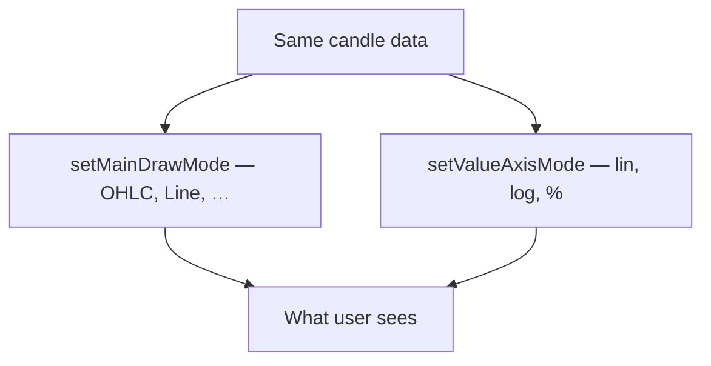

import ChartQuickstartExample from "@site/src/components/ChartQuickstartExample";

# Rendering and scales

Same data, different **look**. Exeria separates:

1. **How** price is drawn (candles, line, bars, …)
2. **How** the Y axis is scaled (linear, log, percent)

You can mix them — for example a **line** on a **log** scale.

<ChartQuickstartExample />

Use the buttons above to switch draw modes on the same dataset. No extra data fetch — just `setMainDrawMode`.

## Draw modes — how price looks

The main series can render as:

| Mode | Best for |
| --- | --- |
| `OHLC` | Classic candlestick chart (default) |
| `Bars` | OHLC as vertical bars |
| `Line` | Simple closing-price line — clean embeds |
| `Histogram` | Volume-style columns |
| `Line and Histogram` | Line plus histogram combined |

Switch anytime:

```ts
chart.setMainDrawMode("OHLC");
chart.setMainDrawMode("Line");
chart.setMainDrawMode("Histogram");
```

Underlying candles stay the same — only the renderer changes. Great for user toggles (“Candles / Line”) without refetching.

### When to use which

| Your product | Suggestion |
| --- | --- |
| Trading terminal | `OHLC` or `Bars` |
| Banking / fintech embed | `Line` — calmer, simpler |
| Volume emphasis | `Histogram` |

See [Fintech integration demo](/starters/fintech-integration) for a minimal line chart in context.

---

## Value axis — how the Y scale behaves

The right-hand price scale supports:

| Mode | Meaning |
| --- | --- |
| `lin` | Normal linear scale (default) |
| `log` | Logarithmic — wide price ranges (crypto, long-term) |
| `perc` or `%` | Percent change from a reference |

```ts
chart.setValueAxisMode("lin");
chart.setValueAxisMode("log");
chart.setValueAxisMode("%");  // same as "perc"
```

`%` is accepted for convenience; internally it becomes `perc`.

**Linear** — equal steps on the axis (100 → 200 feels same distance as 200 → 300).  
**Log** — percentage moves look equal (useful when price went from 1 to 1000).  
**Percent** — “how much up/down from start” rather than absolute price.

---

## Autoscale — fit price to the screen

When autoscale is **on**, the chart zooms the Y axis so visible candles fill the panel:

```ts
chart.setAutoScale(true);

if (chart.getAutoScale()) {
  console.log("Chart fits visible range automatically");
}
```

Turn off when you want a fixed manual range (advanced).

**Note:** calling `setValueAxisMode` turns autoscale back **on** as a side effect. If the axis suddenly jumps, check that.

---

## Value axis width

Need an external legend or button aligned with the chart edge?

```ts
const width = chart.getValueAxisWidth();
```

Returns the rendered width of the price column — handy for pixel-perfect layouts.

---

## Rendering vs scale — quick reference



Two knobs, one dataset. Change draw mode for presentation; change scale for how big moves feel.

---

## Common questions

| Question | Answer |
| --- | --- |
| Do I reload data when switching to Line? | No — `setMainDrawMode` only |
| Why did Y axis reset? | `setValueAxisMode` re-enables autoscale |
| Candles look flat on crypto | Try `log` scale for large ranges |

## What is next?

- [Autoscale and value axis](../chart-usage/autoscale-and-value-axis) — full method reference
- [Custom theme](../tutorials/custom-theme) — colors independent of draw mode
- [Drawing and interaction](../chart-usage/drawing-and-interaction) — crosshair, zoom, pan
