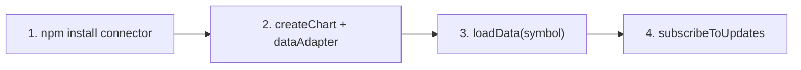

import BinanceConnectorExample from "@site/src/components/BinanceConnectorExample";

# Data connectors

You **can** load candles from your own API ([Chart with your data](../tutorials/chart-with-your-data)). But when the data lives on Binance, Bybit, OKX, Kraken, KuCoin, Coinbase, Gate.io, CCXT-backed exchanges, CoinGecko, or a third-party market data API, a **Data Connector** does the boring work for you: fetch history, open WebSockets, parse candles, retry on errors.

<BinanceConnectorExample />

Try the demo above — switch symbol and timeframe. That is a Data Connector in action.

## When to use a connector

| Situation | Best path |
| --- | --- |
| Public crypto from Binance | [Binance connector](./binance) — **no API key** |
| Public crypto from Bybit | [Bybit connector](./bybit) — **no API key** |
| Public crypto from OKX | [OKX connector](./okx) — **no API key** |
| Public crypto USD spot from Kraken | [Kraken connector](./kraken) — **no API key** |
| Public crypto USDT spot from KuCoin | [KuCoin connector](./kucoin) — **no API key** |
| Public crypto USD/USDC spot from Coinbase | [Coinbase connector](./coinbase) — **no API key** |
| Public crypto USDT spot from Gate.io | [Gate.io connector](./gate) — **no API key** |
| Many exchanges from one package (backend) | [CCXT connector](./ccxt) — **Node.js** |
| Forex or multi-asset (stocks + FX + crypto) | [Massive](./massive), [Twelve Data](./twelve-data), [Finnhub](./finnhub), [EODHD](./eodhd), or [Finage](./finage) — **API key** |
| Broad crypto catalog, daily bars | [CoinGecko](./coingecko) — coin ids, REST polling |
| US stocks and ETFs | [Massive](./massive), [Finnhub](./finnhub), [EODHD](./eodhd), or [Twelve Data](./twelve-data) — API key |
| Your company's own prices | Your API + `setMainSeriesData` |

## Available connectors

| Connector | Data | API key? | Status |
| --- | --- | --- | --- |
| [Binance](./binance) · [live demo](/binance-example) | Crypto spot | No | ✅ Ready today |
| [Bybit](./bybit) · [live demo](/bybit-example) | Crypto spot | No | ✅ Ready today |
| [OKX](./okx) · [live demo](/okx-example) | Crypto spot | No | ✅ Ready today |
| [Kraken](./kraken) · [live demo](/kraken-example) | Crypto spot (USD) | No | ✅ Ready today |
| [KuCoin](./kucoin) · [live demo](/kucoin-example) | Crypto spot (USDT) | No | ✅ Ready today |
| [Coinbase](./coinbase) · [live demo](/coinbase-example) | Crypto spot (USD / USDC) | No | ✅ Ready today |
| [Gate.io](./gate) · [live demo](/gate-example) | Crypto spot (USDT) | No | ✅ Ready today |
| [CCXT](./ccxt) · [live demo](/ccxt-example) | 100+ crypto exchanges | No (public data) | ✅ Ready today |
| [Twelve Data](./twelve-data) · [live demo](/twelve-data-example) | Forex, stocks, crypto | Yes (API key) | ✅ Ready today |
| [Finage](./finage) · [live demo](/finage-example) | Forex, stocks, crypto | Yes (API key) | ✅ Ready today |
| [Finnhub](./finnhub) · [live demo](/finnhub-example) | US stocks, forex, crypto | Yes (API token) | ✅ Ready today |
| [EODHD](./eodhd) · [live demo](/eodhd-example) | Global stocks, forex, crypto | Yes (API token) | ✅ Ready today |
| [Massive](./massive) · [live demo](/massive-example) | US stocks, forex, crypto | Yes (API key) | ✅ Ready today |
| [CoinGecko](./coingecko) · [live demo](/coingecko-example) | 10,000+ crypto assets | Free demo tier | ✅ Ready today |

Compare pricing and licenses on the [Data Connectors catalog](/data-connectors).

## The whole flow in four steps

Every connector follows the same pattern:



```ts
import { createChart } from "@efixdata/exeria-chart";
import { BinanceAdapter } from "@efixdata/connector-binance";

const connector = new BinanceAdapter();

const chart = createChart({ container, dataAdapter: connector });
chart.init();

await chart.loadData("BTCUSDT", { interval: "1h", limit: 1000 });

chart.subscribeToUpdates("BTCUSDT", (tick) => {
  console.log(tick.c ?? tick.price);
});
```

No manual `fetch`, no candle parsing — the connector speaks to the chart in the shapes it already understands ([Data model](../core-concepts/data-model)).

## What is a connector, in one sentence?

A small npm package that implements the **`DataAdapter`** interface: “give me history for this symbol” and “push me live ticks.” Your API keys (if any) stay in **your** app — never in the chart library.

Details: [Overview](./overview).

## Pick your next page

| Goal | Read |
| --- | --- |
| Understand how connectors work | [Overview](./overview) |
| Ship crypto charts today | [Binance](./binance), [Bybit](./bybit), [OKX](./okx), [Kraken](./kraken), [KuCoin](./kucoin), [Coinbase](./coinbase), or [Gate.io](./gate) |
| Many exchanges on your backend | [CCXT](./ccxt) |
| Forex or multi-asset charts | [Massive](./massive), [Twelve Data](./twelve-data), [Finnhub](./finnhub), [EODHD](./eodhd), or [Finage](./finage) |
| Portfolio / news use cases | [CoinGecko](./coingecko) |
| US stocks and ETFs | [Massive](./massive), [Finnhub](./finnhub), [EODHD](./eodhd), or [Twelve Data](./twelve-data) |
| Build your own connector | [Overview → custom connector](./overview#build-your-own-connector) |

## Quick troubleshooting

| Problem | Fix |
| --- | --- |
| Blank chart after `loadData` | Check symbol spelling (`BTCUSDT` not `BTC-USD`) |
| No live updates | Call `subscribeToUpdates` **after** `loadData` |
| Switching symbol acts weird | `unsubscribeFromUpdates()` first |
| Need exact method types | [API Reference](../api-reference/data-connectors) |

Tutorial walkthrough: [Connect with a Data Connector](../tutorials/connect-with-data-connector).
