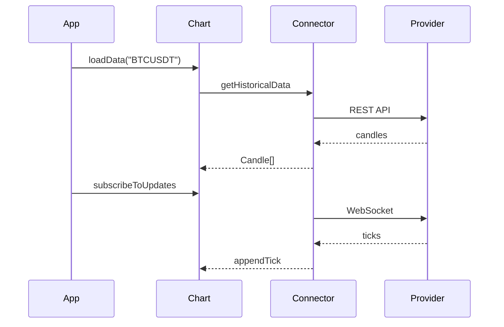

import BinanceConnectorExample from "@site/src/components/BinanceConnectorExample";

# Data Connectors overview

A **Data Connector** is a bridge between a market data provider (Binance, Bybit, OKX, Kraken, KuCoin, Coinbase, Twelve Data, Finage, CCXT-backed exchanges, CoinGecko, your broker) and your Exeria chart. You install a package, pass it to `createChart`, and call `loadData` — the connector handles HTTP, WebSockets, and retries.

<BinanceConnectorExample />

## Why bother with a connector?

Without one you write:

- REST calls to download history
- WebSocket code for live prices
- Parsing into `{ stamp, o, h, l, c, v }`
- Reconnect logic when the network drops

A connector bundles that into a few method calls. Switch from Binance to another source later by swapping the package — your chart code stays similar. For many exchanges on a backend, use the [CCXT connector](./ccxt) and change only `exchangeId`.

| Benefit | Plain meaning |
| --- | --- |
| **Modular** | Chart package stays small; install only the feed you need |
| **Secure** | API keys live in your env vars, not in our library |
| **Consistent** | Same `loadData` / `subscribeToUpdates` for every provider |

## Dedicated vs universal (CCXT)

| | Dedicated (`adapter-binance`, …) | Universal ([CCXT](./ccxt)) |
| --- | --- | --- |
| Exchanges | One per package | 100+ via `exchangeId` |
| Runtime | Browser + Node.js | Node.js (recommended) |
| Live updates | Native WebSocket | REST polling |
| Bundle | Small | Large — keep on server |

Use dedicated connectors for production browser charts on a single exchange. Use CCXT when you need many exchanges on a backend or want to prototype quickly without shipping a new adapter per exchange.

## Forex and multi-asset (Twelve Data, Finage)

| | Crypto connectors | [Twelve Data](./twelve-data) | [Finage](./finage) |
| --- | --- | --- | --- |
| Asset class | Crypto spot | Forex, stocks, crypto, ETFs | Forex, stocks, crypto |
| API key | Not required (public) | **Required** | **Required** |
| Symbol style | `BTCUSDT` | `EUR/USD` | `EURUSD` |
| Live transport | WebSocket | WebSocket | WebSocket or REST polling |
| Best for | Crypto terminals | Quick multi-asset demo | Finage customers, UK vendor |

Both forex vendors fit when you need FX alongside traditional assets. Run the adapter on your server and proxy requests to the chart — same pattern as [CCXT](./ccxt).

## Connector lifecycle

Think of five steps every time:

| Step | What you do |
| --- | --- |
| 1. **Install** | `npm install @efixdata/connector-binance` (or another connector) |
| 2. **Create** | `new BinanceAdapter()` (or factory from that connector's docs) |
| 3. **Wire** | `createChart({ container, dataAdapter: connector })` then `init()` |
| 4. **Load** | `await chart.loadData("BTCUSDT", { interval: "1h", limit: 1000 })` |
| 5. **Stream** | `chart.subscribeToUpdates("BTCUSDT", callback)` |

When the user leaves:

```ts
chart.unsubscribeFromUpdates();
await connector.disconnect();
```



## Quick start (Binance)

```bash
npm install @efixdata/exeria-chart @efixdata/connector-binance
```

```ts
import { createChart } from "@efixdata/exeria-chart";
import { BinanceAdapter } from "@efixdata/connector-binance";

const connector = new BinanceAdapter();

const chart = createChart({
  container,
  dataAdapter: connector,
});

chart.init();

await chart.loadData("BTCUSDT", {
  interval: "1h",
  limit: 1000,
});

chart.subscribeToUpdates("BTCUSDT", (tick) => {
  console.log(tick.price ?? tick.c, new Date(tick.stamp));
});
```

Optional date range instead of “latest N bars”:

```ts
await chart.loadData("BTCUSDT", {
  interval: "1d",
  from: new Date("2024-01-01"),
  to: new Date("2024-12-31"),
});
```

Full `loadData` options: [Loading data](../chart-usage/loading-data#loading-data-with-connectors).

## Switch symbol or timeframe

Always unsubscribe before loading a new symbol:

```ts
chart.unsubscribeFromUpdates();

await chart.loadData("ETHUSDT", {
  interval: "1d",
  limit: 500,
});

chart.subscribeToUpdates("ETHUSDT");
```

Same chart instance, new feed — no remount required.

## Handle errors

Wrap `loadData` in try/catch and show something friendly in your UI:

```ts
try {
  await chart.loadData("BTCUSDT", { interval: "1h", limit: 1000 });
} catch (error) {
  console.error("Could not load market data:", error);
  // show retry button, fallback message, etc.
}
```

The chart does not emit connector-specific error events today — your app owns user feedback.

## Build your own connector {#build-your-own-connector}

Proprietary feed? Implement the `DataAdapter` interface from `@efixdata/exeria-chart`:

```ts
import type { Candle, DataAdapter, LoadDataOptions, Tick } from "@efixdata/exeria-chart";

class MyConnector implements DataAdapter {
  async initialize(_config: Record<string, unknown>): Promise<void> {}

  async getHistoricalData(symbol: string, options: LoadDataOptions): Promise<Candle[]> {
    // fetch from your API, return { stamp, o, h, l, c, v }[]
    return [];
  }

  async getCurrentPrice(symbol: string): Promise<Tick> {
    return { stamp: Date.now(), price: 0 };
  }

  subscribeToUpdates(symbol: string, callback: (update: Tick) => void): () => void {
    // open WebSocket, call callback on each tick
    return () => {}; // unsubscribe function
  }

  async disconnect(): Promise<void> {}
}
```

Pass it the same way: `createChart({ dataAdapter: new MyConnector() })`.

Method-by-method reference: [API Reference](../api-reference/data-connectors).

## Best practices (short list)

**API keys**

- Store in environment variables, never in source control
- Use separate keys for dev and production

**Performance**

- Use `limit` to avoid downloading more history than you need
- `unsubscribeFromUpdates()` when the chart is hidden
- `disconnect()` on page unload

**Security**

- Never log API keys
- Validate symbol strings from user input before passing to connectors

## Troubleshooting

### No candles on screen

1. Is the symbol valid on that exchange? (`BTCUSDT` not `BTC-USD`)
2. Is the interval supported? (see connector docs)
3. Did you call `init()` before `loadData`?
4. Log the error from try/catch around `loadData`

### Live price frozen

1. Did you call `subscribeToUpdates` after `loadData`?
2. Check WebSocket in browser DevTools → Network
3. Firewall or corporate proxy blocking WSS?

### Rate limits

1. Use `limit` instead of huge date ranges
2. Cache history in your backend for popular symbols
3. Upgrade API tier if the provider offers one

## What is next?

- [Binance](./binance) — crypto today, no API key
- [Bybit](./bybit) — crypto today, no API key
- [OKX](./okx) — crypto today, no API key
- [Kraken](./kraken) — USD spot, no API key
- [KuCoin](./kucoin) — USDT spot, no API key
- [Coinbase](./coinbase) — USD / USDC spot, no API key
- [Gate.io](./gate) — USDT spot, no API key
- [CCXT](./ccxt) — 100+ exchanges via one package (Node.js)
- [Twelve Data](./twelve-data) — forex and multi-asset OHLCV (API key)
- [Finage](./finage) — forex OHLCV via Finage (API key)
- [Finnhub](./finnhub) — US stocks, forex, and crypto via Finnhub (API token)
- [EODHD](./eodhd) — global EOD + intraday via EODHD (API token)
- [CoinGecko](./coingecko) — wide asset coverage via coin ids
- [Massive](./massive) — US stocks, forex, and crypto (API key)
- [Data Connectors catalog](/data-connectors) — compare providers and licenses
