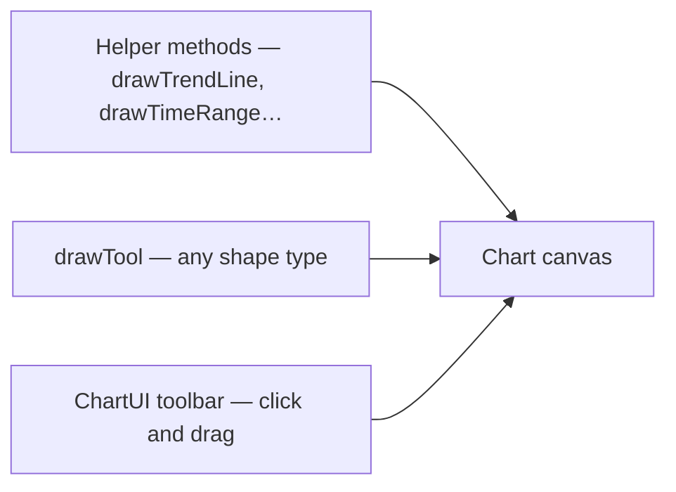

import DrawingToolShowcase from "@site/src/components/DrawingToolShowcase";

# Drawing tools overview

A **drawing** is a shape on top of the chart — lines, boxes, Fibonacci levels, text. It stays glued to **price** and **time** when the user scrolls or zooms.

<DrawingToolShowcase
  visiblePresets={["trendLine", "fibonLines", "hLine", "timeRange", "timeBet"]}
  initialPreset="trendLine"
/>

## Three ways to create drawings



| Path | When to use |
| --- | --- |
| **Helper** | Common cases with fewer lines of code |
| **`drawTool()`** | Specific `type`, custom anchors, extra fields |
| **ChartUI toolbar** | Interactive drawing — no code per shape |

## Helper methods (start here)

The chart exposes these methods on `toolDrawer`:

| Method | Draws |
| --- | --- |
| `drawTrendLine()` | Two-point trend line |
| `drawTimeRange()` | Shaded time window + label |
| `drawTimeBet()` | Directional risk/reward box |
| `drawLongShortPosition()` | Long/short paper-trade box |
| `drawTool()` | Anything in the [catalog](./catalog) (36 types) |
| `deleteTool(id)` | Remove a shape you created |

Example — horizontal support level:

```ts
const toolId = chart.toolDrawer.drawTool({
  type: "hLine",
  color: "#14f7ab",
  priceTag: true,
  anchors: [
    {
      stamp: candles[candles.length - 1].stamp,
      offset: 0,
      value: 42000,
      _index: 0,
    },
  ],
});
```

## What is an anchor?

An **anchor** is one point on the chart — a timestamp and a price:

```ts
{
  stamp: 1715472000000,  // when (UTC ms)
  offset: 0,
  value: 102.8,            // price on Y axis
  _index: 0,
}
```

| Tool | Anchors needed |
| --- | ---: |
| Horizontal line | 1 |
| Trend line | 2 |
| Parallel channel | 3 |
| Triangle | 3 |

More anchors = more complex shape. The [catalog](./catalog) lists anchor counts per type.

Some tools use **expandable** anchors (`expandable`, `defaultDirection`) so lines can extend left/right after placement — the React UI sets these by default for trend lines and Fibonacci.

## Shared visual fields

Most tools accept:

| Field | Meaning |
| --- | --- |
| `color` | Line or stroke color |
| `width` | Line thickness |
| `dash` | Dashed pattern, e.g. `[8, 4]` |
| `text` | Label on the shape |
| `fillBg` | Fill the area inside (boxes, channels) |

Advanced tools (Fibonacci, ABCD) add `values` and `valuesState` arrays to show/hide individual levels.

## Draw with the mouse (ChartUI)

Mount [ChartUI](../getting-started/react) and use the **left toolbar**. Tools are grouped:

| Group | Tools |
| --- | --- |
| Lines | Trend line, parallel channel, horizontal / vertical lines |
| Shapes | Arrow, ellipse, triangle, box |
| Analytical | ABCD, cycle, Fibonacci retracement |
| Ranges | Horizontal range, vertical range |
| Tag | Price tag |

`textAnnotation` exists in the runtime but is **not** in the visible menu today — create it with `drawTool()` in code.

Toolbar deep dive: [React UI toolbar and tools](../advanced/react-ui-toolbar-and-tools).

## Magnet and lock

| Control | What it does |
| --- | --- |
| **Magnet** | Snaps new anchors to the nearest OHLC on the candle under the cursor |
| **Lock all** | Drawings stay visible but cannot be dragged |

In code:

```ts
chart.setDrawingMagnetEnabled(true);
chart.lockAllDrawings();
chart.unlockAllDrawings();
```

Events: `DRAWING_MAGNET_CHANGE`, `DRAWINGS_LOCK_CHANGE`.

## Remove a drawing

```ts
const id = chart.toolDrawer.drawTrendLine({ /* … */ });

if (id !== undefined) {
  chart.toolDrawer.deleteTool(id);
}
```

## One limitation to know

`toolDrawer` places drawings on the **main panel** by default. Per-panel placement is an advanced runtime topic: [Chart runtime access](../advanced/chart-class-runtime).

## What is next?

- [Catalog](./catalog) — every `type` key
- [Trend line](./trend-line) — simplest helper
- [Drawing tools recipes](../tutorials/drawing-tools-recipes) — copy-paste walkthrough
