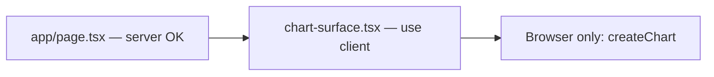

import GettingStartedDemo from "@site/src/components/GettingStartedDemo";

# Next.js App Router

Next.js renders pages on the **server** first. Exeria Charts needs the **browser** (`window`, `document`, canvas). This guide keeps the chart in a **client component** so the server never tries to draw it.

<GettingStartedDemo
  variant="react"
  caption="Same chart you would get in Vite — safe for Next.js App Router."
/>

## The one rule to remember

Put all chart code in a file that starts with:

```tsx
"use client";
```

Without that line, Next.js runs your code on the server and the chart will crash or fail silently.

## Step 1 — Install

In your Next.js project:

```bash
npm install @exeria/charts @exeria/charts-ui
```

## Step 2 — Create the chart component

Add `app/components/chart-surface.tsx` (path can match your folder structure):

```tsx
"use client";

import { useEffect, useRef, useState } from "react";
import type { Candle, ChartInstance, Interval } from "@exeria/charts";
import { ChartUI } from "@exeria/charts-ui";

const candles: Candle[] = [
  { stamp: 1715472000000, o: 101.2, h: 103.1, l: 100.9, c: 102.8, v: 3200 },
  { stamp: 1715475600000, o: 102.8, h: 104.2, l: 102.1, c: 103.9, v: 2950 },
];

const interval: Interval = {
  symbol: "1h",
  milis: 60 * 60 * 1000,
};

export function ChartSurface() {
  const containerRef = useRef<HTMLDivElement | null>(null);
  const [chart, setChart] = useState<ChartInstance | null>(null);

  useEffect(() => {
    let disposed = false;
    let instance: ChartInstance | null = null;

    const mountChart = async () => {
      const container = containerRef.current;
      if (!container) {
        return;
      }

      // Import only in the browser — avoids server-side evaluation
      const { createChart } = await import("@exeria/charts");
      if (disposed) {
        return;
      }

      instance = createChart({ container });
      instance.init();
      await instance.setMainSeriesData(candles, interval);

      if (disposed) {
        instance.destroy();
        return;
      }

      setChart(instance);
    };

    void mountChart();

    return () => {
      disposed = true;
      instance?.destroy();
    };
  }, []);

  return (
    <div style={{ height: 560 }}>
      <ChartUI chart={chart}>
        <div ref={containerRef} style={{ width: "100%", height: "100%" }} />
      </ChartUI>
    </div>
  );
}
```

**Why `import()` inside `useEffect`?** Next.js can still analyze static imports at build time. Dynamic import inside the effect guarantees the chart module loads only in the browser.

## Step 3 — Use it on a page

Your page file (`app/page.tsx`) can stay a **server component** — it only imports the client chart:

```tsx
import { ChartSurface } from "./components/chart-surface";

export default function Page() {
  return (
    <main style={{ padding: 24 }}>
      <h1>Market overview</h1>
      <ChartSurface />
    </main>
  );
}
```

No `"use client"` needed on the page itself. Only `ChartSurface` must be a client component.

## How it fits in Next.js



## Optional: lazy load the whole chart

For a lighter first paint, wrap the chart in `next/dynamic` with `ssr: false`:

```tsx
import dynamic from "next/dynamic";

const ChartSurface = dynamic(
  () => import("./components/chart-surface").then((m) => m.ChartSurface),
  { ssr: false, loading: () => <p>Loading chart…</p> },
);
```

Use this if the chart is below the fold or not needed immediately.

## Checklist

- [ ] `"use client"` at the top of the chart file
- [ ] `createChart` imported inside `useEffect` (or entire file is client-only)
- [ ] Wrapper `div` has fixed height
- [ ] `destroy()` in the effect cleanup

## Real-world example

See the [Fintech integration demo](/starters/fintech-integration) — a consumer-style Next.js embed with light theme and touch-friendly layout.

## What is next?

- [React quickstart](./react) — same ChartUI pattern, framework-agnostic explanation
- [Loading data](../chart-usage/loading-data) — swap inline candles for API data
- [Mobile and responsive](../advanced/mobile-and-responsive) — touch layouts for banking apps
