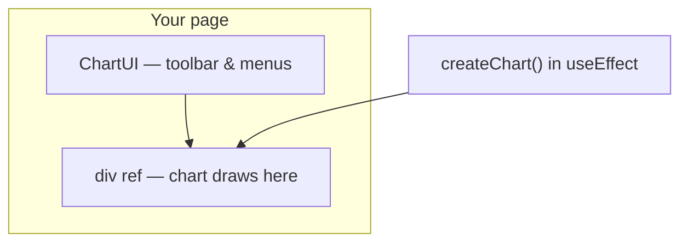

import GettingStartedDemo from "@site/src/components/GettingStartedDemo";

# React quickstart

React apps need two packages: the **chart engine** and **ChartUI** — a wrapper that adds the toolbar, drawing tools menu, and settings panels around your chart.

<GettingStartedDemo
  variant="react"
  caption="What you will build: chart + toolbar, like a mini trading terminal."
/>

## What you need

- A React project (any version that supports hooks)
- Basic familiarity with `useEffect` — or an AI assistant to paste this for you

## Step 1 — Install both packages

```bash
npm install @exeria/charts @exeria/charts-ui
```

| Package | What it does |
| --- | --- |
| `@exeria/charts` | Draws candles, lines, indicators |
| `@exeria/charts-ui` | Adds toolbar and menus around the chart |

## Step 2 — Copy this component

Create a file (for example `ChartExample.tsx`) and paste:

```tsx
import { useEffect, useRef, useState } from "react";
import {
  createChart,
  type Candle,
  type ChartInstance,
  type Interval,
} from "@exeria/charts";
import { ChartUI } from "@exeria/charts-ui";

const candles: Candle[] = [
  { stamp: 1715472000000, o: 1.1, h: 1.2, l: 1.05, c: 1.18, v: 2500 },
];

const interval: Interval = {
  symbol: "1h",
  milis: 60 * 60 * 1000,
};

export function ChartExample() {
  const containerRef = useRef<HTMLDivElement | null>(null);
  const [chart, setChart] = useState<ChartInstance | null>(null);

  useEffect(() => {
    const container = containerRef.current;
    if (!container) {
      return;
    }

    let disposed = false;
    const instance = createChart({ container });

    instance.init();

    void (async () => {
      await instance.setMainSeriesData(candles, interval);

      if (!disposed) {
        setChart(instance);
      }
    })();

    return () => {
      disposed = true;
      instance.destroy();
    };
  }, []);

  return (
    <div style={{ height: 480 }}>
      <ChartUI chart={chart}>
        <div ref={containerRef} style={{ width: "100%", height: "100%" }} />
      </ChartUI>
    </div>
  );
}
```

Render `<ChartExample />` anywhere in your app.

## How the pieces fit together



1. **`useEffect`** runs once when the component mounts.
2. **`createChart`** attaches to the inner `div`.
3. **`setChart(instance)`** tells `ChartUI` the engine is ready — toolbar buttons start working.
4. **Cleanup** calls `destroy()` when the component unmounts.

## Important rules (easy to miss)

| Rule | Why |
| --- | --- |
| Outer wrapper needs `height: 480px` (or similar) | Chart cannot size itself from nothing |
| Chart `div` must be **inside** `<ChartUI>` | Toolbar wraps around that child |
| `ChartUI` can receive `chart={null}` at first | It renders immediately; toolbar activates when chart is set |

## Styling

- **Chart colors** (candles, grid): pass `theme` to `createChart({ … })`
- **Toolbar colors**: pass `theme` to `<ChartUI theme={…} />`

Play with colors in the [live theme creator](../theming/live-theme-creator).

## Stack-specific setup

| Your stack | Guide |
| --- | --- |
| New Vite project | [Vite + React](./vite-react) |
| Next.js App Router | [Next.js App Router](./nextjs-app-router) |
| Plain JS, no React | [Vanilla quickstart](./vanilla) |

## What is next?

- [Add an indicator](../tutorials/add-an-indicator) — EMA and RSI in two lines
- [Custom theme](../tutorials/custom-theme) — match your brand
- [React UI integration](../advanced/react-ui-integration) — deeper ChartUI options
