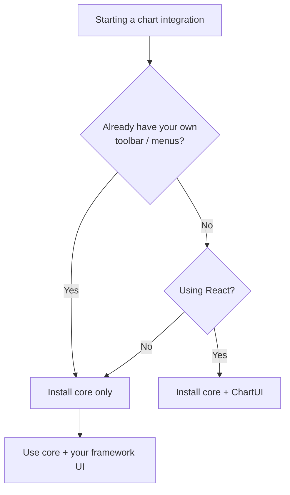

import GettingStartedDemo from "@site/src/components/GettingStartedDemo";

# Choosing a package

Exeria Charts ships as **two npm packages**. You can install one or both. This page helps you pick without over-engineering day one.

<GettingStartedDemo
  variant="vanilla"
  caption="Core only — chart canvas, no built-in toolbar."
/>

## The two packages

| Package | What you get |
| --- | --- |
| `@exeria/charts` | Chart engine — candles, indicators, drawings, data connectors |
| `@exeria/charts-ui` | **ChartUI** — toolbar, indicators menu, settings dialogs around the chart |

ChartUI **depends on** the core package. It does not replace it — you still call `createChart()` and pass the instance into `<ChartUI chart={chart}>`.

## Decision flow



## Choose core only (`@exeria/charts`)

Best when:

- You build a **custom trading terminal** with your own top bar and side panels
- You embed a **minimal chart** in an article or dashboard tile
- You use **Vue, Svelte, or plain HTML** (no React)
- You want the **smallest bundle** and full layout control
- You integrate via **WebView** with native chrome

```bash
npm install @exeria/charts
```

Guide: [Vanilla quickstart](../getting-started/vanilla).

You still get: data connectors, indicators, drawings, theming, mobile layout API — just no pre-built React toolbar.

## Choose core + ChartUI (`@exeria/charts-ui`)

Best when:

- You want a **working terminal UI** quickly — intervals, indicators, settings, drawings
- You already use **React** (Vite, Next.js, CRA, …)
- Your product can accept the **default toolbar layout** (or hide parts via `theme.toolbar`)
- You are prototyping and can refine chrome later

```bash
npm install @exeria/charts @exeria/charts-ui
```

Guide: [React quickstart](../getting-started/react).

<GettingStartedDemo
  variant="react"
  caption="Core + ChartUI — toolbar and left menu included."
/>

## Compare at a glance

| Feature | Core only | + ChartUI |
| --- | --- | --- |
| Candles, zoom, pan | ✅ | ✅ |
| Indicators / strategies | ✅ (code or your UI) | ✅ + picker dialog |
| Drawing tools | ✅ (`toolDrawer`) | ✅ + left menu |
| Chart settings dialog | API only | ✅ built-in |
| Top toolbar | You build | ✅ built-in |
| Mobile compact toolbar | Your CSS | ✅ built-in |
| Theming | Runtime `theme` | Runtime + UI `theme` prop |
| SSR / Next.js | Your boundary | [Next.js guide](../getting-started/nextjs-app-router) |

## Recommended path for beginners

1. **Prove data flow** with core only or React quickstart — one symbol, one timeframe.
2. If you use React and need toolbar → add ChartUI.
3. Hide buttons you do not need (`theme.toolbar`) before rebuilding the shell.
4. Read [Advanced integration](../advanced/) when you customize mobile or share.

## Data connectors work with both

```ts
import { BinanceAdapter } from "@efix-data/adapter-binance";
// or: import { BybitAdapter } from "@efix-data/adapter-bybit";
// or: import { OkxAdapter } from "@efix-data/adapter-okx";

const chart = createChart({ container, dataAdapter: new BinanceAdapter() });
```

Connectors attach to **core** — ChartUI is optional on top. See [Binance](../data-connectors/binance), [Bybit](../data-connectors/bybit), [OKX](../data-connectors/okx), [Kraken](../data-connectors/kraken), or [KuCoin](../data-connectors/kucoin) for exchange-specific setup.

## Licensing is the same core

Both packages are AGPL v3 for the open-source distribution. Closed-source products need a [commercial license](./licensing) regardless of whether you use ChartUI.

## What is next?

- [Vanilla quickstart](../getting-started/vanilla)
- [React quickstart](../getting-started/react)
- [Licensing](./licensing)
- [Choosing data path](../data-connectors/) — connector vs your API
