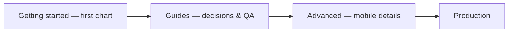

import GettingStartedDemo from "@site/src/components/GettingStartedDemo";

# Guides

Short, practical pages for decisions you make **before** and **after** integration — which npm packages to install, what license you need, and how to QA mobile layouts.

Not step-by-step coding tutorials — those live in [Getting started](../getting-started/) and [Tutorials](../tutorials/).

<GettingStartedDemo
  variant="react"
  caption="Most production apps use both packages — core chart + ChartUI."
/>

## Pick your page

| You want to… | Read |
| --- | --- |
| Core only vs React UI wrapper | [Choosing a package](./choosing-a-package) |
| Try themes and tools without coding | [Playground guide](./playground) → [/playground](/playground) |
| Fix a blank chart or stuck live price | [FAQ and troubleshooting](./faq-and-troubleshooting) |
| AGPL, commercial license, Data Connectors | [Licensing](./licensing) |
| Test phone / tablet before release | [Mobile QA checklist](./mobile-qa-checklist) |

## How guides fit the docs

| Section | When |
| --- | --- |
| [Getting started](../getting-started/) | First mount |
| [Guides](./choosing-a-package) (here) | Package + legal + QA |
| [Advanced integration](../advanced/) | ChartUI, breakpoints, touch |
| [API reference](../api-reference/) | Method lookup (synced from TypeScript) |

## Common questions

| Question | Answer |
| --- | --- |
| Do I need two npm packages? | Only if you want built-in toolbar — [Choosing a package](./choosing-a-package) |
| Can I ship a closed-source SaaS? | You need a **commercial license** for the core — [Licensing](./licensing) |
| Is mobile supported? | Yes — run the [Mobile QA checklist](./mobile-qa-checklist) |
| Where is viewport / touch documented? | [Mobile and responsive](../advanced/mobile-and-responsive) |

Ready? Start with [Choosing a package](./choosing-a-package) if you are still scaffolding the project.
