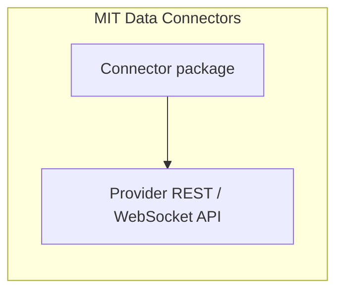
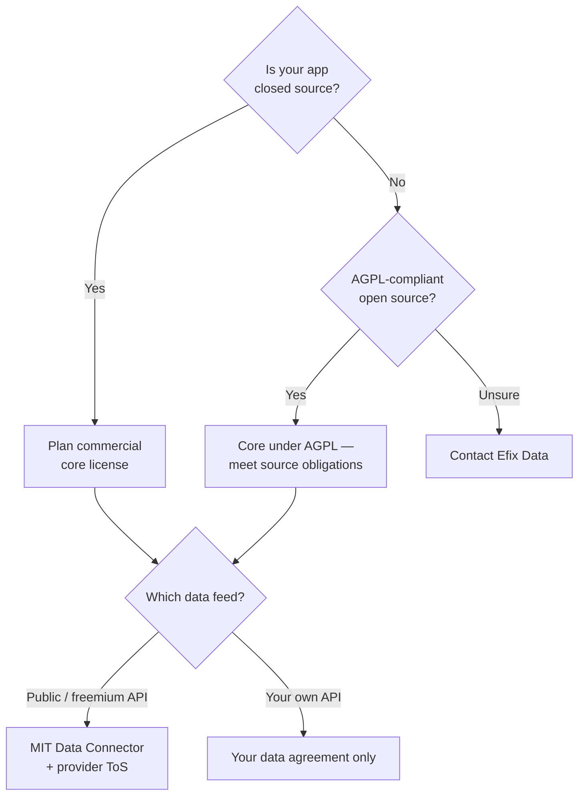

# Licensing

You can ship products with Exeria Charts. **Two questions** decide what you need:

1. Is your **app** open source (AGPL-compliant) or **closed source**?
2. Which **Data Connectors** feed the chart — and what are the **data provider's** terms?

This page is a **plain-language guide**, not legal advice. When in doubt, contact Efix Data before production launch.

## The one-minute summary

| Your situation | Core chart (`@exeria/charts`) | Data Connectors |
| --- | --- | --- |
| **Open-source app**, AGPL-compliant | Free under **AGPL v3** | **MIT** connector packages + provider API terms |
| **Closed-source / proprietary app** | **Commercial license** required | Same — MIT connectors + provider API terms |

Official text: [LICENSE](https://github.com/Efixdata/exeria-charts/blob/main/LICENSE) · [LICENSING.md](https://github.com/Efixdata/exeria-charts/blob/main/LICENSING.md)

Compare connectors: [Data Connectors catalog](/data-connectors).

## What is licensed?

| Component | License model |
| --- | --- |
| **Core chart** + **ChartUI** | Open source under **GNU AGPL v3** |
| **Commercial license** | Paid agreement for **closed-source** use of the core |
| **Data Connectors** | **MIT** npm packages — use with the provider's market data API on their terms |

Built-in **indicators**, **functions**, **strategies**, and **drawing tools** ship in the open core. Optional market data goes through **Data Connectors** from third-party vendors (Binance, Massive, Finnhub, and others).

## AGPL v3 — the core (free, with obligations)

AGPL is a **strong copyleft** license. In practice:

- You may use, modify, and redistribute the core for free.
- If you **distribute** software that incorporates the core, or offer it as a **network service** users interact with, you generally must make **corresponding source** available under AGPL-compatible terms.
- If you **cannot** open your application source on those terms, you need a **commercial license** instead of relying on AGPL alone.

**Open-source projects** that publish source under AGPL (or compatible terms) can use the core at no charge — provided you meet AGPL obligations for your combined work.

## Commercial license — closed-source products {#commercial-license}

A **commercial license** from Efix Data Sp. z o. o. is for teams shipping a **proprietary** application.

It typically covers:

- Using the core in closed-source products without AGPL applying to your **entire** codebase (as defined in your agreement)
- Predictable terms for production and customer-facing deployments
- **Startup-friendly pricing** for qualifying small teams — contact us; pricing is not enterprise-only by default

A commercial core license is **separate** from any **market data subscription** you buy from Massive, Finnhub, Twelve Data, or other vendors.

## Data Connectors licensing {#data-connectors-licensing}

Data Connectors are **MIT** packages. You still must follow each **data provider's** terms (rate limits, attribution, redistribution, display rights).

### MIT connectors

| Connector | Package license | Data |
| --- | --- | --- |
| [Binance](../data-connectors/binance) | MIT | Public crypto — no API key |
| [Bybit](../data-connectors/bybit) | MIT | Public crypto spot — no API key |
| [OKX](../data-connectors/okx) | MIT | Public crypto spot — no API key |
| [Kraken](../data-connectors/kraken) | MIT | Public USD spot — no API key |
| [KuCoin](../data-connectors/kucoin) | MIT | Public USDT spot — no API key |
| [Coinbase](../data-connectors/coinbase) | MIT | Public USD / USDC spot |
| [Gate.io](../data-connectors/gate) | MIT | Public USDT spot — no API key |
| [EODHD](../data-connectors/eodhd) | MIT | Global EOD + intraday — API token required |
| [CoinGecko](../data-connectors/coingecko) | MIT | Broad crypto catalog |
| [Massive](../data-connectors/massive) | MIT | US stocks, forex, crypto — provider API key |
| [Finnhub](../data-connectors/finnhub) | MIT | US stocks, forex, crypto — provider API token |
| [Twelve Data](../data-connectors/twelve-data) | MIT | Multi-asset — provider API key |
| [Finage](../data-connectors/finage) | MIT | Forex and equities — provider API key |

- Install via npm, use in open-source or commercial apps per **MIT** terms for the connector package.
- You still must follow the **data provider's** terms (rate limits, attribution, redistribution).
- Your **chart core** may still need a **commercial license** if the overall product is closed source — MIT on the connector does not remove AGPL obligations on the core.

Full MIT terms on the catalog: [MIT license](/data-connectors#mit-license).

### Your own API

Loading candles from **your backend** (`setMainSeriesData`) does not use a Data Connector license — you own the data contract. See [Chart with your data](../tutorials/chart-with-your-data).

## Enterprise

Enterprise agreements typically combine:

- Commercial **core** license for closed-source products
- Integration and onboarding support

Contact Efix Data for Enterprise and startup commercial terms.

## Decision checklist before you ship

- [ ] Read [`LICENSE`](https://github.com/Efixdata/exeria-charts/blob/main/LICENSE)
- [ ] Closed source? → plan **commercial core** license
- [ ] Using a Data Connector? → MIT package + **provider** rules
- [ ] Still unsure? → contact before launch

## What ships in the open core

The public repository includes:

- Chart runtime, ChartUI, drawing tools documented in [Drawing tools](../drawing-tools/)
- **97** indicators, **10** functions, **11** strategies ([Scripts hub](../scripts/))
- MIT Data Connectors for public and freemium market data APIs

## What is next?

- [Data connectors overview](../data-connectors/overview)
- [Data Connectors catalog](/data-connectors)
- [Choosing a package](./choosing-a-package)
- [Guides hub](../guides/)
