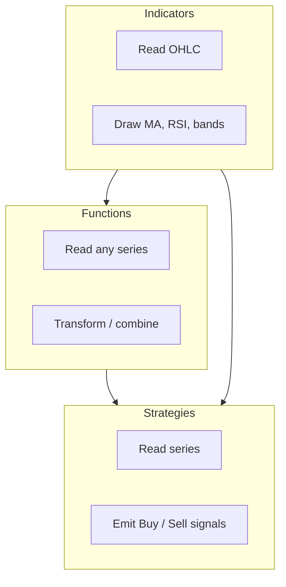

import TutorialChartDemo from "@site/src/components/TutorialChartDemo";

# Functions overview

If indicators are **classic studies** (RSI, MACD), **functions** are the chart’s **formula layer** — they take one or more numeric series and return a new series.

There is no “market logic” built in. You supply the inputs.

<TutorialChartDemo scene="indicators" caption="Functions often consume indicator outputs — add the source indicator first." />

## Why functions exist

| Without functions | With functions |
| --- | --- |
| Only pre-built studies | Custom math on any line |
| Hard to shift or combine lines | `DISPLACE`, `IGLUE`, `SUM` in the UI |
| Strategies limited to defaults | Feed strategies your own series |

Think **spreadsheet formulas** tied to bar timestamps.

## Functions vs indicators vs strategies



| Type | Output | Example |
| --- | --- | --- |
| Indicator | Lines, bands, histograms | `EMA` → orange line |
| Function | Numeric series | `DISPLACE(EMA)` → shifted EMA |
| Strategy | Signal markers | `CROSS(EMA, SMA)` → buy/sell arrows |

## All 10 built-in functions

| Key | Display name | One-line purpose |
| --- | --- | --- |
| `HIGHEST` | Highest | Rolling highest **high** (or chosen series) |
| `LOWEST` | Lowest | Rolling lowest **low** |
| `FIBONACCI` | Fibonacci | Rolling Fib levels from high/low |
| `DISPLACE` | Displace | Time-shift a series + optional offset |
| `IGLUE` | Indicator Glue | Add / subtract / multiply / divide two series |
| `IMOD` | Indicator Modifier | Apply math between a series and a constant |
| `IF` | IF | Three-way compare: A vs B → X, Y, or Z |
| `SUM` | Sum | Add up to 10 conditional inputs |
| `AVERAGE` | Average | Mean of up to 10 inputs (skips gaps) |
| `1x` | 1/x | Reciprocal of a series |

Full defaults and pane column: [Function catalog](./catalog).

## Two tiers: plug-and-play vs wiring

### Tier 1 — works on price out of the box

These default to main-series **high** or **low**:

```ts
chart.addScript("HIGHEST");
chart.addScript("LOWEST");
chart.addScript("FIBONACCI");
```

They draw as **overlays** on the main chart.

### Tier 2 — needs a source series

Add the producer first, then point the function at its output in settings or code:

| Function | Main input | Typical wiring |
| --- | --- | --- |
| `DISPLACE` | `DSERIES` | Output of `EMA` |
| `IGLUE` | Two series | `EMA` + `SMA` |
| `IMOD` | Series + constant | `RSI` × 2 |
| `IF` | `VAL_A`, `VAL_B` | EMA vs SMA (conditional mode) |
| `SUM` / `AVERAGE` | Up to 10 inputs | Several indicator lines |
| `1x` | One series | Invert any positive series |

Walkthrough: [Programmatic wiring](../programmatic-wiring).

## Input types you will see

| Input type | UI behavior |
| --- | --- |
| `series` | Dropdown of `Symbol.Field` references |
| `integer` / `double` | Periods, offsets, constants |
| `list` | Operation picker (`Add`, `Multiply`, …) |
| `conditional` | Toggle **Number** vs **Series** per value |

[Series and panels](../series-and-panels) explains dropdown labels and `seriesId:field` format.

## Panel behavior

| Key | Default pane |
| --- | --- |
| Overlay on main chart | `HIGHEST`, `LOWEST`, `FIBONACCI`, `DISPLACE`, `IGLUE`, `IMOD` |
| New panel below | `IF`, `SUM`, `AVERAGE`, `1x` |

Override in the **Panel** dropdown like any indicator.

## Visibility

Functions appear under **Chart settings → On chart → Functions** with plot and scale toggles — [Chart settings](../../chart-usage/chart-settings).

API: `setChartFunctionVisibility`, `setChartFunctionPriceTagVisibility`, `removeChartFunction`.

## Example pipeline (beginner-friendly)

**Goal:** shaded regime line — 1 when EMA &gt; SMA, -1 when below.

```ts
chart.addScript("EMA");
chart.addScript("SMA");

const emaRef = getSeriesReference(chart, "EMA");
const smaRef = getSeriesReference(chart, "SMA");

const ifScript = structuredClone(chart.getScripts().IF);
ifScript.inputs.VAL_A.value = { type: "series", value: emaRef };
ifScript.inputs.VAL_B.value = { type: "series", value: smaRef };
ifScript.inputs.VAL_X.value = { type: "double", value: 1 };
ifScript.inputs.VAL_Y.value = { type: "double", value: 0 };
ifScript.inputs.VAL_Z.value = { type: "double", value: -1 };

chart.addScript("IF", ifScript);
```

(`getSeriesReference` — copy from [Programmatic wiring](../programmatic-wiring).)

## What is next?

- [Function catalog](./catalog) — all 10 keys with inputs/outputs
- [Key functions](./key-functions) — three starters
- [Custom function authoring](./custom-functions)
- [Strategies overview](../strategies/overview) — consume function outputs as signals
