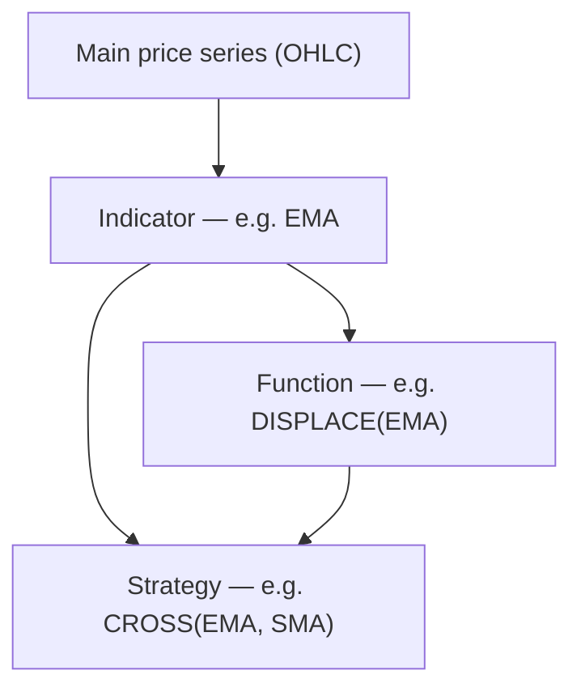

import TutorialChartDemo from "@site/src/components/TutorialChartDemo";

# Indicators, strategies, and functions

Your chart can show more than candles. Exeria ships **97 indicators**, **10 functions**, and **11 strategies** — all added with the same API: `chart.addScript("KEY")`.

This section explains the three types in plain language, how to pick **which data series** feeds a study, and how to choose **which panel** it draws on.

<TutorialChartDemo scene="indicators" caption="Example: EMA on the price chart + RSI in its own panel below." />

## Pick your page

| You want to… | Read |
| --- | --- |
| Understand the three script types | [Overview](./overview) |
| Choose input series and target panel | [Series and panels](./series-and-panels) |
| Wire scripts together in code | [Programmatic wiring](./programmatic-wiring) |
| Add a moving average or oscillator | [Indicators](./indicators/overview) |
| Transform or combine series (new concept) | [Functions](./functions/overview) |
| Generate Buy/Sell signals (new concept) | [Strategies](./strategies/overview) |
| Look up every built-in key | [Indicator](./indicators/catalog) · [Function](./functions/catalog) · [Strategy](./strategies/catalog) catalogs |

## The three types in one sentence each

| Type | What it does | Think of it as… |
| --- | --- | --- |
| **Indicator** | Computes a derived line or histogram from price (or volume) | Classic RSI, MACD, Bollinger Bands |
| **Function** | Transforms or combines **any** numeric series | Spreadsheet formula on chart data |
| **Strategy** | Emits **trading signals** (Buy, Sell, Exit…) when rules fire | Rule engine that draws arrows on the chart |



## How you add anything

**From ChartUI:** toolbar → **Indicators** → tabs *Indicator* / *Function* / *Strategy* → pick one → adjust settings → OK.

**From code:**

```ts
chart.addScript("EMA");
chart.addScript("RSI");
chart.addScript("CROSS");
chart.addScript("DISPLACE");
```

List available keys:

```ts
console.log(Object.keys(chart.getScripts()));
```

Tutorial: [Add an indicator](../tutorials/add-an-indicator).

## Built-in counts (current registry)

| Category | Count | Catalog |
| --- | ---: | --- |
| Indicators | **97** | [Full list](./indicators/catalog) |
| Functions | **10** | [Full list](./functions/catalog) |
| Strategies | **11** | [Full list](./strategies/catalog) |

## Quick troubleshooting

| Problem | Page to check |
| --- | --- |
| Indicator uses wrong price field | [Series and panels](./series-and-panels) |
| RSI covers the candles | Panel selector → **New panel** |
| Strategy shows no arrows | Inputs may still point at defaults — [Programmatic wiring](./programmatic-wiring) |
| Function flat / empty | Wire `DSERIES` to a real output — [Functions overview](./functions/overview) |

Ready? Start with [Overview](./overview) or [Series and panels](./series-and-panels) if you configure studies in the UI.
