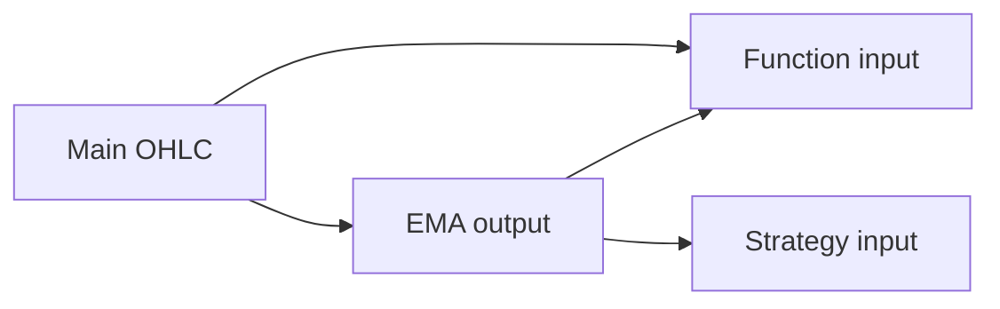

import TutorialChartDemo from "@site/src/components/TutorialChartDemo";

# Series and panels

When you add an indicator, function, or strategy, two choices shape the result:

1. **Series** — *what data* goes into the formula
2. **Panel** — *where* the output is drawn

This page covers both — in ChartUI and in code.

<TutorialChartDemo scene="indicators" caption="EMA uses close prices on the main panel; RSI uses close in its own panel." />

## Series — the data feeding the script

### What is a “series”?

A **series** is a column of numbers aligned to chart time — one value per bar:

| Example series | Field | Typical use |
| --- | --- | --- |
| Main symbol close | `c` | RSI, EMA defaults |
| Main symbol high | `h` | `HIGHEST`, band upper bounds |
| Main symbol volume | `v` | Volume studies |
| EMA output | `EMA` | Input to `DISPLACE` or `CROSS` |
| RSI output | `RSI` | Custom strategy thresholds |

In code, the chart stores references as:

```text
seriesId:field
```

Example: `mainSeriesId:c` for close (exact `seriesId` comes from `getSeriesManager()`).

### Picking a series in ChartUI

1. Toolbar → **Indicators** (or add from catalog).
2. Pick indicator / function / strategy.
3. In **Parameters**, find inputs labeled **Series**, **Price CLOSE**, **A Series**, etc.
4. Open the dropdown — options look like `SymbolName.Close`, `EMA.EMA`, `RSI.RSI`.



The dropdown is built from `chart.getSeriesManager()` — every series currently on the chart, including outputs from scripts you already added.

**Order matters:** add the **source** indicator first, then the function/strategy that consumes it.

### Default series matching

When you open settings, the dialog auto-picks a series if an input has `properties.def`:

- `def: "c"` → matches main close
- `def: "h"` → matches high
- `def: "MACDLine"` → matches MACD line output after MACD is on the chart

If nothing matches, the first available series is used.

### Conditional inputs (functions)

Some inputs toggle between **constant number** and **series**:

| Mode | Use when |
| --- | --- |
| **Number** | Fixed threshold (e.g. RSI &gt; 70) |
| **Series** | Compare two live lines (e.g. EMA vs SMA) |

`IF`, `SUM`, and `AVERAGE` use this pattern. In the UI you pick *Number* or *Series* first, then the value or dropdown.

### Multi-instrument charts

With a second symbol overlaid ([Multi-instrument charts](../chart-usage/multi-instrument-charts)), overlay series appear in the same dropdown. You can run RSI on the **overlay’s close** instead of the main symbol.

### Series in code

```ts
function getSeriesReference(chart, field: string): string {
  const series = Object.values(chart.getSeriesManager()).find((s) =>
    s.fields.includes(field),
  );
  if (!series?.seriesId) throw new Error(`Field ${field} not found`);
  return `${series.seriesId}:${field}`;
}

const ema = structuredClone(chart.getScripts().EMA);
chart.addScript("EMA", ema);

const emaRef = getSeriesReference(chart, "EMA");

const displaced = structuredClone(chart.getScripts().DISPLACE);
displaced.inputs.DSERIES.value = emaRef;
chart.addScript("DISPLACE", displaced);
```

More examples: [Programmatic wiring](./programmatic-wiring).

## Panels — where the script draws

### Main chart vs new panel

| Placement | Best for | Examples |
| --- | --- | --- |
| **Overlay** (main chart) | Lines on candles | EMA, BBAND, KELTNERCHANNEL |
| **New panel** | Oscillators, volume-style | RSI, MACD, ATR, OBV |
| **Existing panel** | Stack related studies | Two indicators sharing one strip |

Each script ships with a default `newPane` flag — see catalogs for **Default pane** column.

### Picking a panel in ChartUI

In the script settings dialog, find **Panel**:

| Option | Effect |
| --- | --- |
| **New panel** | Creates a new row below the chart |
| **Main chart** | Draws on the price pane |
| **Named panel** | Reuses an existing pane (e.g. after RSI already opened one) |

Changing panel updates `config.pane` and `config.newPane` before the script is applied.

### When to override defaults

| Situation | Try |
| --- | --- |
| RSI hides candles | Panel → **New panel** (RSI defaults to this already) |
| Compare two MAs on price | Panel → **Main chart** for both |
| MACD + RSI stacked | Add MACD (new panel), add RSI → Panel → pick MACD’s panel **or** separate panels |

### Panels in code

`ChartInstance` exposes:

```ts
chart.getChartPanels();
// [{ id: "…", label: "Main chart", main: true }, { id: "…", label: "RSI", main: false }]
```

Panel targeting on `addScript(proto)` uses the `pane` field on the cloned `ScriptDefinition` (same as UI). Advanced hosts can also call `addPanelToModel()` on the `Chart` class — [Chart runtime access](../advanced/chart-class-runtime).

### Price tags on the scale

In **Chart settings → On chart**, toggle **Scale** per layer to show/hide the last-value label on the Y axis — independent of which panel the script uses.

## End-to-end UI checklist

1. Load candles (`setMainSeriesData` or connector).
2. Add base studies first (e.g. `EMA`, then `SMA`).
3. Open each study’s settings → verify **series** inputs.
4. Set **Panel** (overlay vs new vs existing).
5. Add functions/strategies that consume earlier outputs.
6. Tune visibility in **Chart settings** layers tabs.

## Quick troubleshooting

| Problem | Fix |
| --- | --- |
| Dropdown missing EMA line | Add EMA and confirm it calculated (enough bars) |
| Strategy always uses MACD | Change `LINE` / `SIGNAL` series inputs away from defaults |
| Two oscillators squash each other | Use separate panels or one panel intentionally |
| Wrong symbol’s close | Re-select series after changing overlay selection |

## What is next?

- [Programmatic wiring](./programmatic-wiring) — clone definitions and set `seriesId:field`
- [Indicators overview](./indicators/overview)
- [Functions overview](./functions/overview)
- [Strategies overview](./strategies/overview)
- [Chart settings](../chart-usage/chart-settings) — visibility layers
