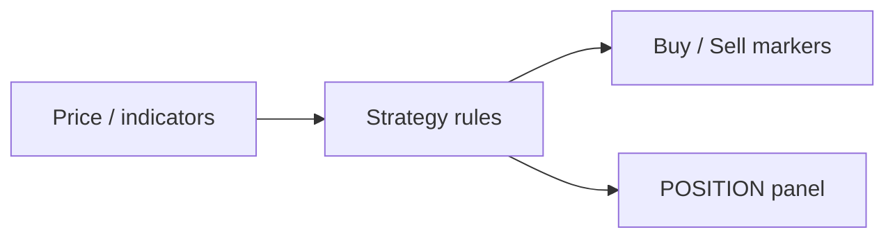

import TutorialChartDemo from "@site/src/components/TutorialChartDemo";

# Strategies overview

A **strategy** is a rule set that watches chart data and places **signal markers** — Buy, Sell, exits — when conditions are met.

If you have only used **indicators** before, strategies are the new idea: output is **discrete trading actions**, not just a line.

<TutorialChartDemo scene="indicators" caption="Strategies draw signal markers; start from CROSS or EXCEED with defaults." />

## What you see on the chart

Strategies render as **arrows or markers** on the main price panel (most keys) or in a **dedicated panel** (`POSITION`, `DIFFER`).

They do **not** place real orders — your app handles execution. The chart visualizes **when** a rule would fire.

## Standard signal vocabulary

Every strategy input/output uses the same Fusion signal set:

| Signal | Typical meaning |
| --- | --- |
| `Buy` | Open / add long |
| `Sell` | Open / add short |
| `Exit long` | Close long |
| `Exit short` | Close short |
| `Exit all` | Flatten everything |
| `Do nothing` | No action this bar |

List inputs (e.g. `ONDN`, `ONUP`) let you pick which signal fires for each rule branch.

## Strategies vs indicators vs functions

| Question | Indicator | Function | Strategy |
| --- | --- | --- | --- |
| Output type? | Numeric series | Numeric series | **Signals** |
| Example output | RSI 0–100 | Shifted EMA | **Buy** arrow |
| Good for | Analysis | Custom math | Rules & backtest UX |
| Default chart | Line / histogram | Line | **Markers** |



## All 11 built-in strategies

| Key | Display name | What it does (plain English) |
| --- | --- | --- |
| `CROSS` | Cross | Signal when series A crosses series B |
| `EXCEED` | Exceed | Signal when price/series breaks above/below bands |
| `REBOUND` | Rebound | Signal when series returns inside a band range |
| `GREATERLESS` | Greater-Less | Signal when A &gt;, &lt;, or = B |
| `CANDLESTICKPATTERNS` | Candlestick Patterns | Pattern detected on OHLC → signal |
| `SINGLE` | Single Signals | Remove duplicate consecutive signals |
| `JOIN` | Join | Combine two strategies (fixed matrix) |
| `DOUBLECHECK` | Double Check | Fire only when both strategies agree |
| `MIX` | Selective Signals | Combine two strategies (editable matrix) |
| `POSITION` | Position Size | Turn signals into position-size line (new panel) |
| `DIFFER` | Buy Sell Size | Turn position size into buy/sell deltas (new panel) |

Full inputs: [Strategy catalog](./catalog).

## Tier 1 — try with defaults

These ship with sensible default series (often MACD or Bollinger + OHLC):

```ts
chart.addScript("CROSS");
chart.addScript("EXCEED");
chart.addScript("CANDLESTICKPATTERNS");
```

`CROSS` defaults to **MACD line vs MACD signal** — add `MACD` first or change series inputs to EMA/SMA in settings.

## Tier 2 — composition strategies

Use after you have **strategy output series** on the chart:

| Key | Needs |
| --- | --- |
| `JOIN`, `DOUBLECHECK`, `MIX` | Two strategy streams (`X`, `Y`) |
| `SINGLE` | One strategy stream to dedupe |
| `POSITION` | Strategy stream → position histogram |
| `DIFFER` | Position-size stream → trade deltas |

Example chain:

1. `CROSS` on EMA vs SMA → signals  
2. `POSITION` on that stream → position panel  
3. `DIFFER` on position → sized buy/sell markers  

[Programmatic wiring](../programmatic-wiring) has copy-paste code.

## Pick input series (critical)

Strategies are only as good as their **series inputs**:

- `CROSS` → `LINE` (A) and `SIGNAL` (B)
- `EXCEED` → upper/lower bands + price series
- `GREATERLESS` → compare any two lines

In ChartUI, each **series** input is a dropdown — same system as indicators ([Series and panels](../series-and-panels)).

## Panel behavior

| Keys | Default placement |
| --- | --- |
| Main chart markers | `CROSS`, `EXCEED`, `REBOUND`, `GREATERLESS`, `JOIN`, `MIX`, `SINGLE`, `DOUBLECHECK`, `CANDLESTICKPATTERNS` |
| New panel | `POSITION`, `DIFFER` |

Override with **Panel** in settings.

## Visibility

**Chart settings → On chart → Strategies** toggles signal visibility.

API: `setChartStrategyVisibility`, `removeChartStrategy`.

## Add from ChartUI

1. Toolbar → **Indicators** → tab **Strategy**.
2. Pick a strategy → configure series and signal lists.
3. Choose **Panel** → OK.

## What is next?

- [Strategy catalog](./catalog) — all 11 keys detailed
- [Key strategies](./key-strategies) — CROSS, EXCEED, POSITION
- [Functions overview](../functions/overview) — build custom series first
- [Programmatic wiring](../programmatic-wiring)
