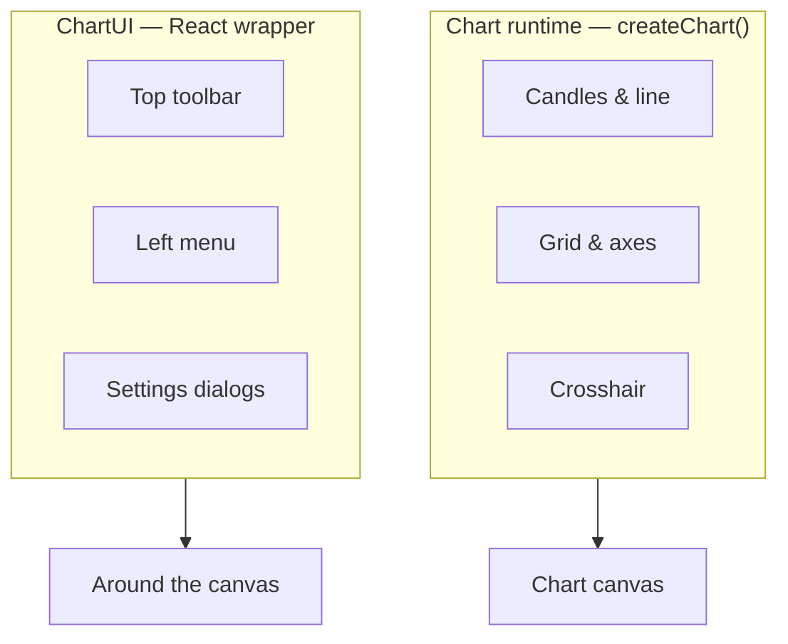

import TutorialChartDemo from "@site/src/components/TutorialChartDemo";

# Theming

Your chart does not have to look like a generic terminal. Exeria separates **what users stare at** (candles, grid, axes) from **the buttons around it** (toolbar, dialogs). Style each layer independently.

<TutorialChartDemo
  scene="custom-theme"
  caption="Runtime theme — background, candles, and grid. Tutorial: Custom theme."
/>

## Pick your page

| You want to… | Read |
| --- | --- |
| Understand the two theme layers | [Overview](./overview) |
| Drag colors and copy code | [Live theme creator](./live-theme-creator) |
| Step-by-step first custom theme | [Custom theme tutorial](../tutorials/custom-theme) |
| User-facing color picker in ChartUI | [Chart settings](../chart-usage/chart-settings) |
| Hide toolbar colors / share button | [React UI integration](../advanced/react-ui-integration) |

## The two layers (do not mix them up)



| Layer | Package | Set where |
| --- | --- | --- |
| **Chart surface** | `@exeria/charts` | `createChart({ theme, themeVariant })` |
| **UI chrome** | `@exeria/charts-ui` | `<ChartUI theme={…} />` |

Vanilla JS app? You only need the **runtime** layer. React with ChartUI? Use **both**.

## Built-in presets (six)

Chart settings and the live theme creator ship the same presets:

| Preset | Mode | Vibe |
| --- | --- | --- |
| Trading Dark | Dark | Default terminal look |
| Midnight | Dark | Deep blue |
| Carbon | Dark | Neutral gray |
| Day | Light | Default light |
| Pearl (Paper) | Light | Warm neutral |
| Monochrome (Onyx) | Light | Black & white |

Users pick these in **Chart settings → Theme templates**. You can apply the same look in code via `applyChartAppearanceSettings` or constructor `theme`.

## Quick start in code

```ts
const chart = createChart({
  container,
  theme: {
    background: "#0b0f17",
    grid: "#1a2233",
    candleUp: "#25ad98",
    candleDown: "#d12e59",
  },
  themeVariant: "dark",
});
```

```tsx
<ChartUI
  chart={chart}
  theme={{
    accentColor: "#14f7ab",
    toolbar: { background: "#111827" },
  }}
>
  <div ref={containerRef} style={{ width: "100%", height: "100%" }} />
</ChartUI>
```

## Quick troubleshooting

| Problem | Fix |
| --- | --- |
| Changed ChartUI theme but candles unchanged | Edit `createChart({ theme })` — not ChartUI |
| Light text on light background | Set `themeVariant: "light"` or fix `axisText` color |
| User picks colors in UI — how to save? | [Save and restore settings](../tutorials/save-and-restore-settings) |
| Want visual picker | [Live theme creator](./live-theme-creator) |

Ready? [Overview](./overview) or jump straight to the [live theme creator](./live-theme-creator).
