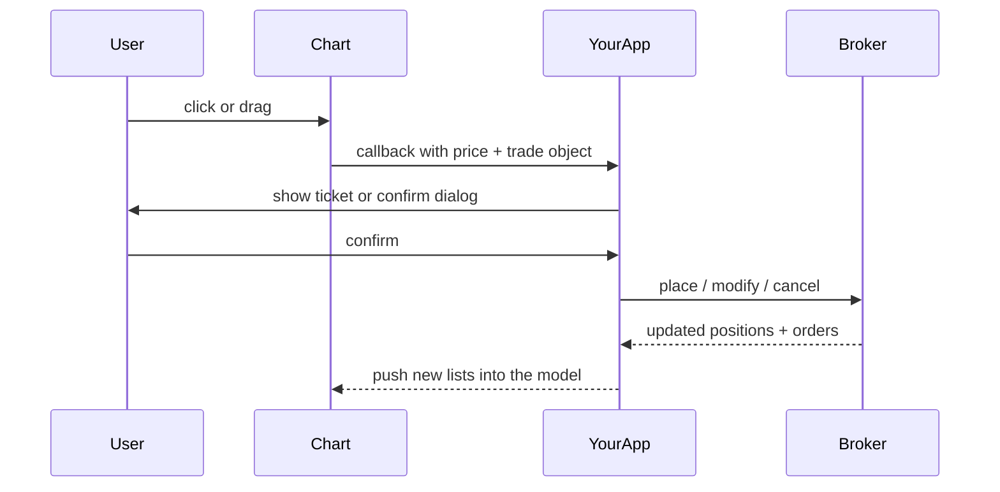

# Trade from chart

Exeria Charts **draws** prices and trade lines. It is **not** a broker. Your app talks to the broker; the chart shows positions and orders you supply, and fires callbacks when the user clicks or drags.

This is an **advanced** tutorial. You should already have [live data](./live-data-stream) and be comfortable with [Chart with your data](./chart-with-your-data).

## What you are building (the user story)

1. User **clicks** the chart → your order form opens with that price filled in.
2. Open **positions** and **orders** appear as lines on the chart (data from your broker).
3. User **drags** a stop line → your app asks the broker to modify the order.
4. User closes a line → your app cancels or closes at the broker.

The chart never owns “truth” about money. After every broker response, **you** refresh what the chart displays.

## How the pieces fit together



## Step 1 — Capture a click price

Mount the chart, then listen for clicks on the container. Convert the mouse position to a price (your integration layer or chart host helpers do this):

```ts
const chart = createChart({ container, instrument });
chart.init();

chart.getInteractor().setMode("CROSSHAIR");

container.addEventListener("click", () => {
  const price = /* resolve Y position to price */;

  openOrderTicket({
    side: "buy",
    limitPrice: price,
    instrument: chart.getInstrument(),
  });
});
```

`openOrderTicket` is **your** UI component. On success, add the new order to the model (step 2).

## Step 2 — Show positions and orders

The chart reads two lists on the model:

- `model.positions.list` — open positions
- `model.orders.list` — working stops, limits, etc.

Each item needs at least an `id`, `type`, `price`, and an `object` blob you round-trip to the broker:

```ts
{
  id: "broker-position-42",
  type: "POSITION",
  price: 1.08452,
  title: "EURUSD",
  parentId: null,
  object: { /* whatever your broker API expects back */ },
}
```

Child stop/take-profit lines use `parentId` pointing at the position id.

After your broker feed updates:

```ts
chartHost.model.positions.list = positionsFromBroker;
chartHost.model.orders.list = ordersFromBroker;
chartHost.repaint?.();
```

## Step 3 — Wire broker callbacks

Assign handlers on the chart host `options` object. The chart calls them when the user closes, drags, or adds related orders:

```ts
host.options.doClosePositionCallback = async (position) => {
  await broker.closePosition(position);
  refreshFromBroker();
};

host.options.doModifyOrderCallback = async (amendRequest) => {
  const ok = await showConfirmDialog(amendRequest);
  if (ok) {
    await broker.modifyOrder(amendRequest);
  }
  refreshFromBroker(); // always sync back to broker truth
};

host.options.doDeleteOrderCallback = async (order) => {
  await broker.cancelOrder(order);
  refreshFromBroker();
};
```

### What happens on drag

1. User drags a position or order line.
2. Chart marks it modified and calls `doModifyOrderCallback` with the new price.
3. Your app confirms (if needed) and calls the broker.
4. You refresh lists from the broker — never assume the drag was accepted until the API says so.

## Step 4 — Planning drawings (optional)

For **paper trading** or education — not live broker lines — use the `longShortPosition` drawing tool. See [Drawing tools catalog](../drawing-tools/catalog).

## Checklist before you ship

- [ ] Instrument marked tradable when orders are allowed
- [ ] Prices rounded to the instrument's tick size before opening tickets
- [ ] Model refreshed after every broker round-trip
- [ ] Errors revert the chart to the last known broker snapshot

## See a full product

- [Crypto terminal demo](/starters/crypto-terminal)
- [Forex platforms demo](/starters/forex-platforms)

## Deeper reference

- [Chart runtime access](../advanced/chart-class-runtime) — `repaint()`, model host APIs
- [Save and restore settings](./save-and-restore-settings) — persist layout with workspace templates
